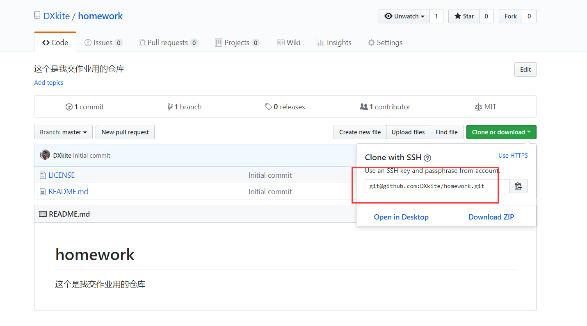
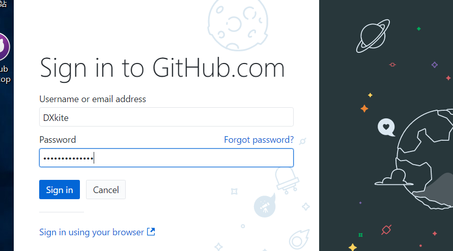
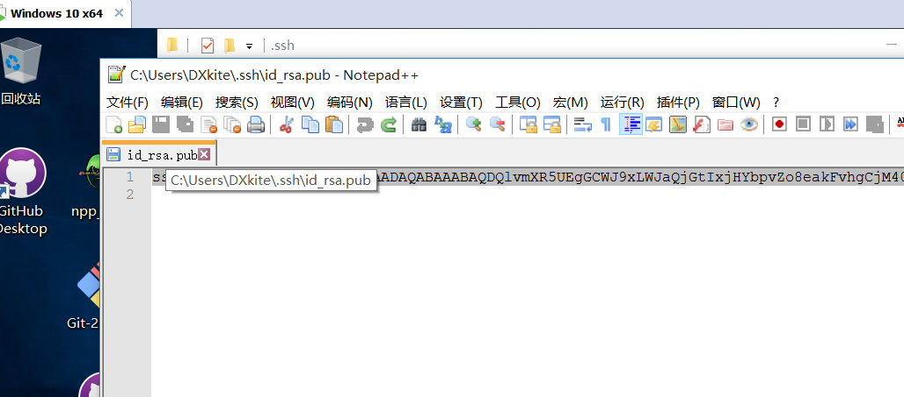
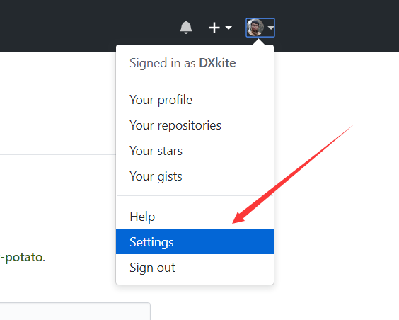
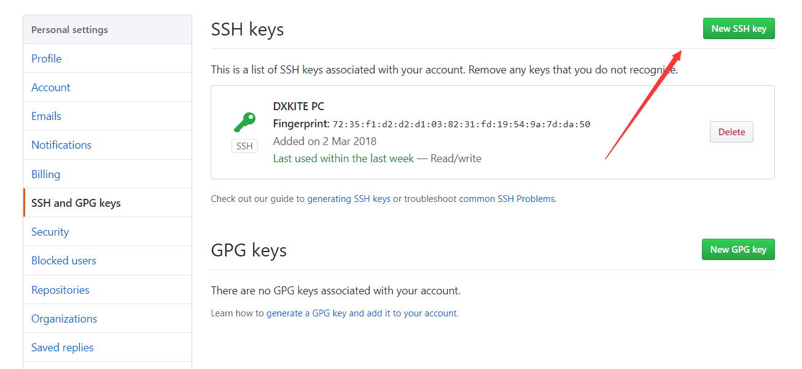
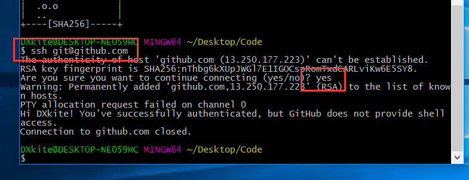
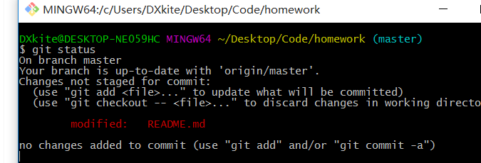
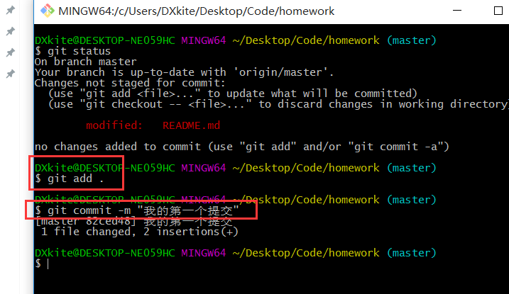
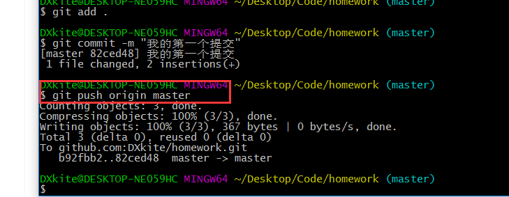
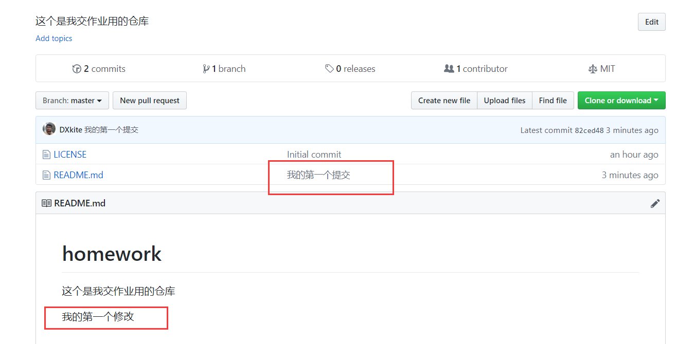

作为一个程序员，版本管理系统我们都要得会啊，本次教一下简单的Git功能的使用

Git 是一个比较流行的代码版本管理系统

<!-- more -->

## 注册一个Github账号

在开始本教程之前，可以先去Github注册一个账号: https://github.com ，英文的网站，如果不熟悉的话可以去 [码云](https://gitee.com)、[Coding](http://coding.net) 去注册账号、注册完成以后就可以浪了

## 创建一个代码仓库

在首页找到 `+` 号，点击后有一个 `New repository` 


点击后出现如下界面 也可以点击访问：https://github.com/new 


填写后即可创建一个代码仓库，创建成功后出现如下界面，复制红框的部分 （git@github.com:DXkite/homework.git）



## Git安装配置

安装如下软件

- **Github Desktop** https://desktop.github.com/ [Windows版本 点击下载](https://central.github.com/deployments/desktop/desktop/latest/win32)
- **Git** https://www.git-scm.com/download/ [Windows版本 点击下载](https://github.com/git-for-windows/git/releases/download/v2.18.0.windows.1/Git-2.18.0-64-bit.exe)

全部安装，安装配置选择默认配置即可，安装完成后登陆 



登陆成功后，会要你配置Git，填写你注册时的账号邮箱即可


点击 Continue 之后即可，点击 Finish 完成

## 配置SSH登陆

选择一个文件夹（最好是放代码的地方），右键鼠标，选择 Git Bash Here


输入运行命令 `ssh-keygen`，然后一直回车就行 


然后找到上图的 id_rsa.pub 文件 `/c/Users/DXkite/.ssh/id_rsa.pub` 既在 ` C:/Users/DXkite/.ssh/id_rsa.pub`

打开文件，复制文件内容



打开Github，选择 Settinng



选择 New SSH Key



填上内容后点击  `Add SSH Key`


点击后会出现一个提示，输入密码，即可，在刚刚的窗口输入命令 `ssh git@github.com`，可能会要你输入`yes`



出现如上提示即可

## 克隆并上传第一个提交

### 克隆仓库

还记得之前复制的红框部分么（git@github.com:DXkite/homework.git）？现在需要使用命令运行一下

```
git clone [红框部分]
```

运行结果如下：


可以发现文件夹内会新建了一个文件夹，打开后，编辑 `README.md`


修改后，在这个文件夹打开 Git Bash 

运行命令 `git status` ，可以看到仓库的状态

> **git status** 用来获取当前仓库的状态



> **git add .** 把文件添加到仓库
> **git commit -m "提交信息"** 添加一个提交



> **git push origin master** 把提交上传到Github



提交完成后，可以查看你的仓库的文件变化 



### 使用Github Desktop 提交

修改文件后，打开 Github Desktop 操作内容如下：


