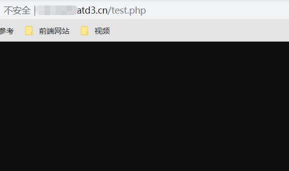
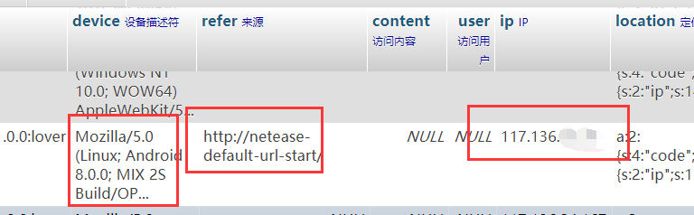

> **本文针对用户群体为不使用代理查看邮件的用户**

还记得那些年，邮箱钓鱼盛行，各种广告邮件钓鱼邮件层出不穷（现在还有某阿X的开发票推送），经过邮箱防水墙能拦截一部分以外，你是否注意到了正常邮箱可能被有心人利用的姿势？

<!-- more -->
## 真·检测邮箱是否已读

某天，工作的时候发送了一封邮件给一个比较重要的人，左等右等，心里在想，TA看了我的邮箱没有？现在通过一个姿势来获取一下自己邮箱的已读状态吧？

**原理** 邮件被打开后很大几率会直接加载邮件中的图片

首先，准备一台服务器，服务器的权限最好是自己有，使用一下代码：

```php
header('Content-Type:image/png');
$im = imagecreatetruecolor (1,1);
$background_color = imagecolorallocatealpha($im, 255, 255, 255, 127);
imagepng($im);
imagedestroy($im);
```

以上代码创建了一个1x1大小的全透明的图片（**谁都看不到哦**），我们把这个图片放到我们自己的服务器上，访问可以看到一张啥都没有的图片：



光是生成图片还不够，我们记录一下 `$_SERVER['HTTP_REFERER']` 和 `$_SERVER['HTTP_USER_AGENT']` 这俩个存储了用户从哪里来，使用了什么用户代理（浏览器设备）过来的，最后还有 `ip`，我们通过如下代码获取：

> 参考：https://github.com/DXkite/suda/blob/master/system/src/suda/core/Request.php#L211

```php  
function get_ip()
{
    static $ipFrom = ['HTTP_CLIENT_IP','HTTP_X_FORWARDED_FOR','HTTP_X_FORWARDED', 'HTTP_X_CLUSTER_CLIENT_IP','HTTP_FORWARDED_FOR','HTTP_FORWARDED','REMOTE_ADDR'];
    foreach ($ipFrom as $key) {
        if (array_key_exists($key, $_SERVER)) {
            foreach (explode(',', $_SERVER[$key]) as $ip) {
                $ip = trim($ip);
                if ((bool) filter_var($ip, FILTER_VALIDATE_IP, FILTER_FLAG_IPV4 | FILTER_FLAG_NO_PRIV_RANGE | FILTER_FLAG_NO_RES_RANGE)) {
                    return $ip;
                }
            }
        }
    }
    return  '127.0.0.1';
}
```

获取完以上数据后，写入到数据库中：

```php
$ip = get_ip();
$from = $_SERVER['HTTP_REFERER'];
$client = $_SERVER['HTTP_USER_AGENT'];
// SQL 插入到数据库中
// ...
```

写完以后，我们在邮件中插入我们的图片（使用URL插入），对方收到后可能是这样的：


对方打开后，那么数据库中：



可以看到对方的信息：

| 字段  | 信息内容  | 解释  |
|----|----|------|
| HTTP_USER_AGENT | Mozilla/5.0 (Linux; Android 8.0.0; MIX 2S Build/OPR1.170623.032; wv) AppleWebKit/537.36 (KHTML, like Gecko) Version/4.0 Chrome/62.0.3202.84 Mobile Safari/537.36 | 从头部分析，可以看到用户通过小米Mix 2S打开的邮件 |
| HTTP_REFERER | http://netease-default-url-start/ | 从来源可以看出，用户通过网易客户端打开邮件 |
| IP | 117.136.\*.\* | 打开时，用户使用的出网IP |

## 通过IP定位

> 这个自己找IP定位设备的网站吧


## 防范

不是每个人上网都带跳板的，所以很容易定位到对应的地址，手机还好，如果是通过电信啥的上网，地理位置很容易就定位了。