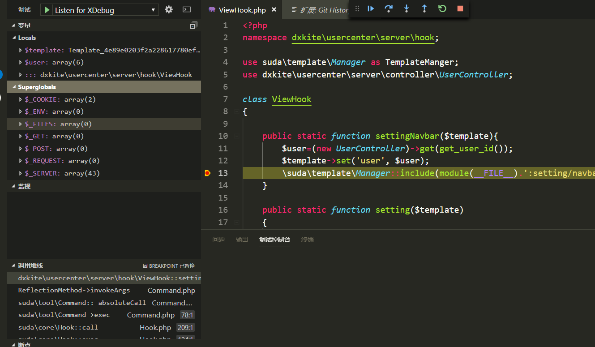

在北京，，忽然就蓝屏，暴躁老哥我直接格式化系统盘。。VSCode重装以后回复一波插件，记录一下

<!-- more -->

## PHP Debug

PHP调试用的东西，需要的时候还行，基本配置：https://xdebug.org/wizard.php



使用方式：把phpinfo的内容复制到框框中：


点击分析之后：


按照配置安装即可，`php.ini` 我的配置，其中带路径的配置，自己调整好。。

```
[XDebug]
xdebug.profiler_output_dir="D:\software\phpStudy\PHPTutorial\tmp\xdebug"
xdebug.trace_output_dir="D:\software\phpStudy\PHPTutorial\tmp\xdebug"
zend_extension = D:\software\phpStudy\PHPTutorial\php\php-7.2.1-nts\ext\php_xdebug-2.6.0-7.2-vc15-nts.dll
xdebug.remote_enable = on
xdebug.remote_handler = dbgp
xdebug.show_local_vars=0
xdebug.remote_autostart= 1
```


## PHP Symbols

用于定位函数和符号


## PHP DocBlocker

自动注释


## php cs fixer

用于格式化代码。需要下载 `php-cs-fixer` 格式化代码美滋滋


## Git History Diff

用于查看变化文件