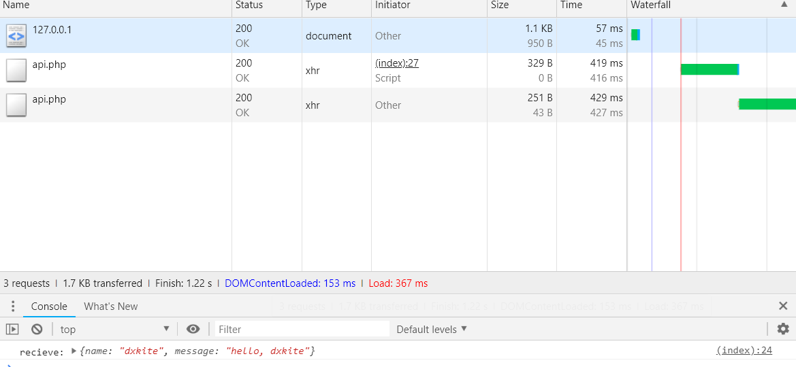
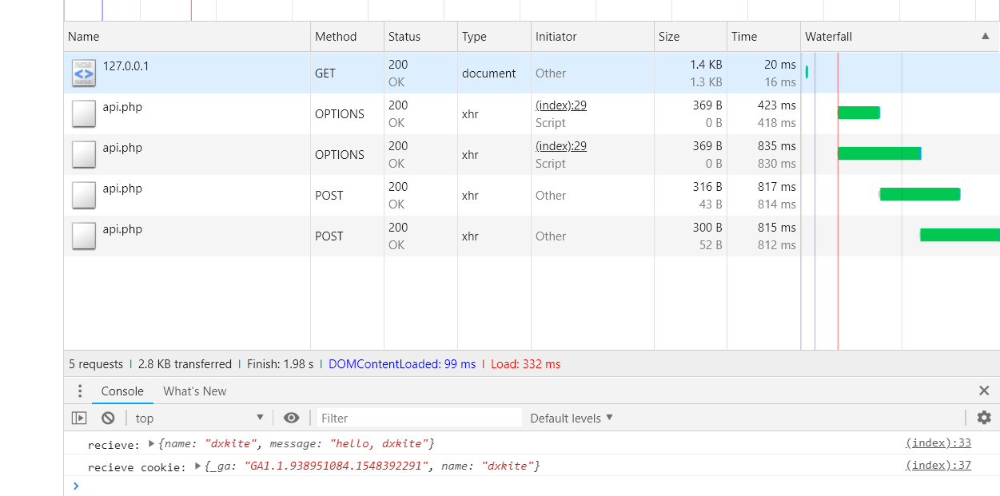

在做网站开发的时候，我们经常会用到异步请求来实现无刷新更新网页，通常我们使用的都是同源API来实现、以及使用 `WebSocket` 协议，这两个协议都离不开浏览器的一个安全判断：**同源策略**。文章中包含了跨站请求的实现与基本会话保持的方案。

<!-- more -->

当我们使用 `XMLHttpRequest` 或者 `Fetch` 方式来实现异步请求网站资源时，同源的网站很好处理，直接请求即可，不同源的网站浏览器会向服务器发送一个请求头来确认服务器是否接受该请求，下面的实现方案基于 `Chrome` 浏览器测试。

## 跨站请求允许

在我们向一个非同源网站发送内容请求之前，浏览器会向服务器发送一个 `OPTIONS` 请求头来确认服务器是否允许此次请求，测试代码：

**测试：从127.0.0.1:8080请求127.0.0.1:8081的内容**

```javascript 
window.addEventListener('load', function () {
    var ajax = new XMLHttpRequest();
    var url = 'http://127.0.0.1:8081/api.php';
    if (ajax) {
        ajax.open('POST', url, true);
        ajax.setRequestHeader('Content-Type','application/json');
        ajax.addEventListener('readystatechange', function () {
            if (ajax.readyState == 4 && ajax.status == 200) {
                var json = JSON.parse(ajax.responseText);
                console.log('recieve:', json);
            }
        });
        ajax.send(JSON.stringify({name:'dxkite'}));
    }
});
```

我们来查看收到的内容：


从浏览器请求期我们可以看到，浏览器向服务器发送了 `OPTIONS` 头，服务器什么都没返回，浏览器因此根据CORS协议将代码BAN了。

####  预请求 `OPTIONS` （preflight request）

当我们请求服务器以非 `GET` 方式请求以及使用不是`Accept`、`Accept-Language`、、`Content-Language``Content-Type`等安全请求头时，浏览器会发送 `OPTIONS` 请求

### 服务器支持跨域

服务器支持跨域，首先要支持 `OPTIONS` 请求，并且要放回特定的请求头。因此我们要处理这个请求：

```
OPTIONS http://127.0.0.1:8081/api.php HTTP/1.1
Host: 127.0.0.1:8081
Access-Control-Request-Method: POST
Origin: http://127.0.0.1:8080
Access-Control-Request-Headers: content-type
```

这里，我们需要将请求头 OPTIONS 处理并返回特定的请求头来回应这个请求。

```php
$origin = 'http://127.0.0.1:8080'; // 请求域名

// 处理请求头
if ($_SERVER['REQUEST_METHOD'] == 'OPTIONS') {
    // 判断请求源并支持从 http://127.0.0.1:8080 请求。
    if ($_SERVER['HTTP_ORIGIN'] == $origin) {
        header('Access-Control-Allow-Origin: '.$origin); // 允许请求的源
        header('Access-Control-Allow-Methods: POST, GET, OPTIONS'); // 允许请求的方法
        header('Access-Control-Allow-Headers: Content-Type'); // 允许请求的附加请求头
        header("Content-Length: 0");
        header("Content-Type: text/plain");
    } else {
        header("HTTP/1.1 403 Access Forbidden");
        header("Content-Type: text/plain");
    }
} elseif ($_SERVER['REQUEST_METHOD'] == 'POST') {
    // 输出头部
    header('Access-Control-Allow-Origin: '.$origin);
    header('Content-Type: application/json');
    // 请求内容
    $json = json_decode(file_get_contents('php://input'), true);
    echo json_encode([ 'name' => $json['name'], 'message' => 'hello, '.$json['name']]);
}
```

再次请求服务器，从如下请求报文中中我们可以看到经过一次 `OPTIONS` 之后浏览器才进行正常的 `POST` 请求。

```
OPTIONS http://127.0.0.1:8081/api.php HTTP/1.1
Host: 127.0.0.1:8081
Connection: keep-alive
Pragma: no-cache
Cache-Control: no-cache
Access-Control-Request-Method: POST
Origin: http://127.0.0.1:8080
User-Agent: Mozilla/5.0 (Windows NT 10.0; WOW64) AppleWebKit/537.36 (KHTML, like Gecko) Chrome/72.0.3608.4 Safari/537.36
Access-Control-Request-Headers: content-type
Accept: */*
Referer: http://127.0.0.1:8080/
Accept-Encoding: gzip, deflate, br
Accept-Language: zh-CN,zh;q=0.9


HTTP/1.1 200 OK
Host: 127.0.0.1:8081
Date: Fri, 01 Feb 2019 11:39:23 +0000
Connection: close
X-Powered-By: PHP/7.2.1
Access-Control-Allow-Origin: http://127.0.0.1:8080
Access-Control-Allow-Methods: POST, GET, OPTIONS
Access-Control-Allow-Headers: Content-Type
Content-Length: 0
Content-type: text/plain;charset=UTF-8

POST http://127.0.0.1:8081/api.php HTTP/1.1
Host: 127.0.0.1:8081
Connection: keep-alive
Content-Length: 17
Pragma: no-cache
Cache-Control: no-cache
Origin: http://127.0.0.1:8080
User-Agent: Mozilla/5.0 (Windows NT 10.0; WOW64) AppleWebKit/537.36 (KHTML, like Gecko) Chrome/72.0.3608.4 Safari/537.36
Content-Type: application/json
Accept: */*
Referer: http://127.0.0.1:8080/
Accept-Encoding: gzip, deflate, br
Accept-Language: zh-CN,zh;q=0.9


HTTP/1.1 200 OK
Host: 127.0.0.1:8081
Date: Fri, 01 Feb 2019 11:39:23 +0000
Connection: close
X-Powered-By: PHP/7.2.1
Access-Control-Allow-Origin: http://127.0.0.1:8080
Content-Type: application/json
```



## 请求头说明

### Access-Control-Allow-Origin

响应头指定了该响应的资源是否被允许与给定的origin共享。

**语法参考**

```
Access-Control-Allow-Origin: *
Access-Control-Allow-Origin: <origin>
```

**参数说明**

- `"*"` 允许所有域都具有访问资源的权限。
- `<origin>` 指定一个可以访问资源的URI。

### Access-Control-Allow-Headers

响应头 `Access-Control-Allow-Headers` 用于预检请求中，列出了将会在正式请求的 `Access-Control-Expose-Headers` 字段中出现的头信息。

**语法参考**

```
Access-Control-Allow-Headers: <header-name>, <header-name>, ...
```

### Access-Control-Allow-Methods

响应头 `Access-Control-Allow-Methods` 在对预检请求（preflight request）的应答中明确了客户端所要访问的资源允许使用的方法或方法列表。

**语法参考**

```
Access-Control-Allow-Methods: <method>, <method>, ...
```

### Access-Control-Expose-Headers

响应首部 `Access-Control-Expose-Headers` 列出了哪些响应头可以作为响应的一部分被浏览器发现（即访问）

**语法参考**

```
Access-Control-Expose-Headers: <header-name>, <header-name>, ...
```

*注*：以下头部不用指定

- Cache-Control
- Content-Language
- Content-Type
- Expires
- Last-Modified
- Pragma

### Access-Control-Max-Age 

指定了预请求可以被缓存的时间


**语法参考**

```
Access-Control-Max-Age: <delta-seconds>
```

`delta-seconds` 参数表示预请求的结果在多少秒内有效。

### Access-Control-Allow-Credentials

`Access-Control-Allow-Credentials` 头指定了当浏览器的`credentials`设置为true时是否允许浏览器读取response的内容。当用在对preflight预检测请求的响应中时，它指定了实际的请求是否可以使用`credentials`。请注意：简单 GET 请求不会被预检；如果对此类请求的响应中不包含该字段，这个响应将被忽略掉，并且浏览器也不会将相应内容返回给网页。

**语法参考**

```
Access-Control-Allow-Credentials: true
```

#### 使用凭证（Cookie）的条件

- 如果服务器端的响应中未携带 `Access-Control-Allow-Credentials: true` ，浏览器将不会把响应内容返回给请求的发送者。
- 对于附带身份凭证的请求，服务器不得设置 `Access-Control-Allow-Origin` 的值为 `"*"` 。
- 响应首部中也携带了 `Set-Cookie` 字段，尝试对 `Cookie` 进行修改。如果操作失败，将会抛出异常

### 带 Cookie 使用异步请求例子

客户端代码：

```javascript
window.addEventListener('load', function () {

    function request(url, data, callback) {
        var ajax = new XMLHttpRequest();
        ajax.withCredentials = true;
        if (ajax) {
            ajax.open('POST', url, true);
            ajax.setRequestHeader('Content-Type', 'application/json');
            ajax.addEventListener('readystatechange', function () {
                if (ajax.readyState == 4 && ajax.status == 200) {
                    var json = JSON.parse(ajax.responseText);
                    callback.call(ajax, json);
                }
            });
            ajax.send(JSON.stringify(data));
        }
    }
    request('http://127.0.0.1:8081/api.php',{name:'dxkite'}, function(recieve){
        console.log('recieve:', recieve);
    });

    request('http://127.0.0.1:8081/api.php',{}, function(recieve){
        console.log('recieve cookie:', recieve);
    });
});
```

服务器端代码：
```php
$origin = 'http://127.0.0.1:8080';

// 处理请求头
if ($_SERVER['REQUEST_METHOD'] == 'OPTIONS') {
    // 判断请求源并支持从 http://127.0.0.1:8080 请求。
    if ($_SERVER['HTTP_ORIGIN'] == $origin) {
        header('Access-Control-Allow-Origin: '.$origin); // 允许请求的源
        header('Access-Control-Allow-Methods: POST, GET, OPTIONS'); // 允许请求的方法
        header('Access-Control-Allow-Headers: Content-Type'); // 允许请求的附加请求头
        header('Access-Control-Allow-Credentials: true'); // 允许携带Cookie
        header("Content-Length: 0");
        header("Content-Type: text/plain");
    } else {
        header("HTTP/1.1 403 Access Forbidden");
        header("Content-Type: text/plain");
    }
} elseif ($_SERVER['REQUEST_METHOD'] == 'POST') {
    // 输出头部
    header('Access-Control-Allow-Origin: '.$origin); // 允许请求的源
    header('Access-Control-Allow-Credentials: true'); // 允许携带Cookie
    header('Content-Type: application/json');
    // 请求内容
    $json = json_decode(file_get_contents('php://input'), true);
    if (array_key_exists('name', $json)) {
        setcookie('name', $json['name']);
        echo json_encode([ 'name' => $json['name'], 'message' => 'hello, '.$json['name']]);
    } else {
        echo json_encode($_COOKIE);
    }
}
```

请求链：

```
OPTIONS http://127.0.0.1:8081/api.php HTTP/1.1
Host: 127.0.0.1:8081
Connection: keep-alive
Pragma: no-cache
Cache-Control: no-cache
Access-Control-Request-Method: POST
Origin: http://127.0.0.1:8080
User-Agent: Mozilla/5.0 (Windows NT 10.0; WOW64) AppleWebKit/537.36 (KHTML, like Gecko) Chrome/72.0.3608.4 Safari/537.36
Access-Control-Request-Headers: content-type
Accept: */*
Referer: http://127.0.0.1:8080/
Accept-Encoding: gzip, deflate, br
Accept-Language: zh-CN,zh;q=0.9


HTTP/1.1 200 OK
Host: 127.0.0.1:8081
Date: Fri, 01 Feb 2019 12:23:44 +0000
Connection: close
X-Powered-By: PHP/7.2.1
Access-Control-Allow-Origin: http://127.0.0.1:8080
Access-Control-Allow-Methods: POST, GET, OPTIONS
Access-Control-Allow-Headers: Content-Type
Access-Control-Allow-Credentials: true
Content-Length: 0
Content-type: text/plain;charset=UTF-8


POST http://127.0.0.1:8081/api.php HTTP/1.1
Host: 127.0.0.1:8081
Connection: keep-alive
Content-Length: 17
Pragma: no-cache
Cache-Control: no-cache
Origin: http://127.0.0.1:8080
User-Agent: Mozilla/5.0 (Windows NT 10.0; WOW64) AppleWebKit/537.36 (KHTML, like Gecko) Chrome/72.0.3608.4 Safari/537.36
Content-Type: application/json
Accept: */*
Referer: http://127.0.0.1:8080/
Accept-Encoding: gzip, deflate, br
Accept-Language: zh-CN,zh;q=0.9
Cookie: _ga=GA1.1.938951084.1548392291; name=dxkite


HTTP/1.1 200 OK
Host: 127.0.0.1:8081
Date: Fri, 01 Feb 2019 12:23:45 +0000
Connection: close
X-Powered-By: PHP/7.2.1
Access-Control-Allow-Origin: http://127.0.0.1:8080
Access-Control-Allow-Credentials: true
Content-Type: application/json
Set-Cookie: name=dxkite


POST http://127.0.0.1:8081/api.php HTTP/1.1
Host: 127.0.0.1:8081
Connection: keep-alive
Content-Length: 2
Pragma: no-cache
Cache-Control: no-cache
Origin: http://127.0.0.1:8080
User-Agent: Mozilla/5.0 (Windows NT 10.0; WOW64) AppleWebKit/537.36 (KHTML, like Gecko) Chrome/72.0.3608.4 Safari/537.36
Content-Type: application/json
Accept: */*
Referer: http://127.0.0.1:8080/
Accept-Encoding: gzip, deflate, br
Accept-Language: zh-CN,zh;q=0.9
Cookie: _ga=GA1.1.938951084.1548392291; name=dxkite


HTTP/1.1 200 OK
Host: 127.0.0.1:8081
Date: Fri, 01 Feb 2019 12:23:45 +0000
Connection: close
X-Powered-By: PHP/7.2.1
Access-Control-Allow-Origin: http://127.0.0.1:8080
Access-Control-Allow-Credentials: true
Content-Type: application/json

```

成功截图：




---
参考文献
- [非安全请求头](https://fetch.spec.whatwg.org/#cors-safelisted-request-header)
- [HTTP访问控制（CORS）](https://developer.mozilla.org/zh-CN/docs/Web/HTTP/Access_control_CORS)