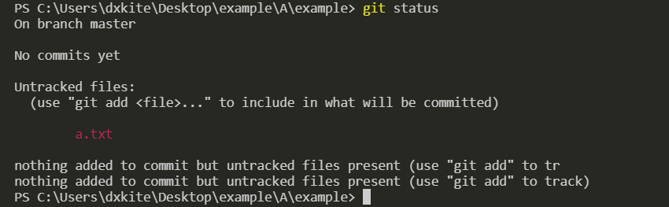
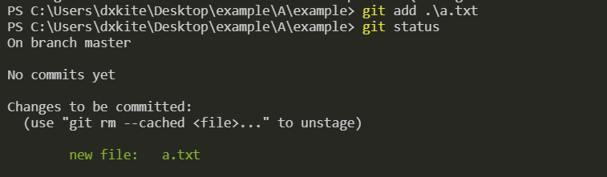
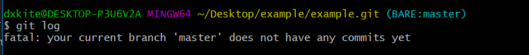
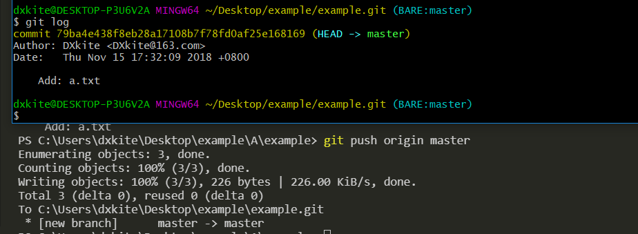
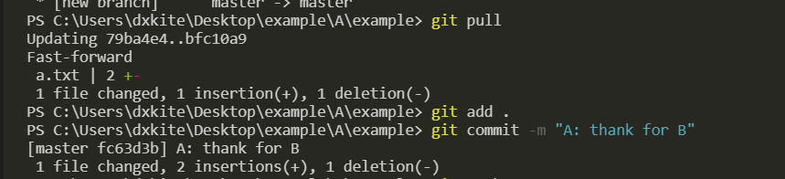
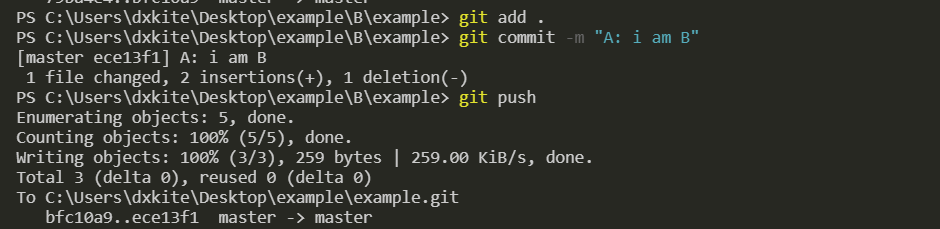
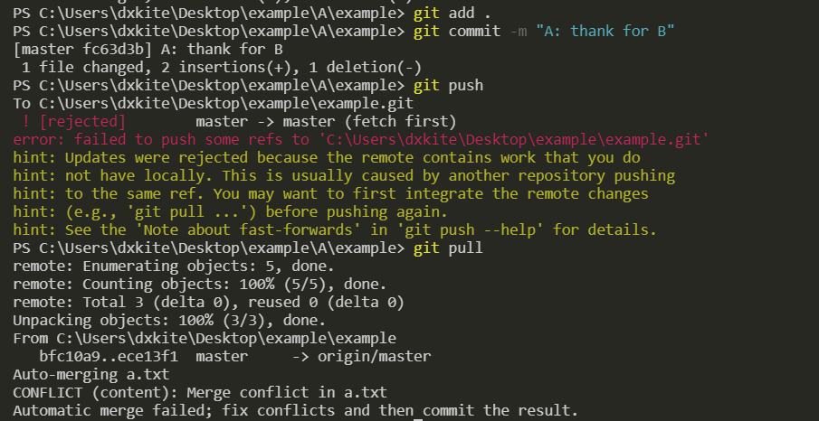
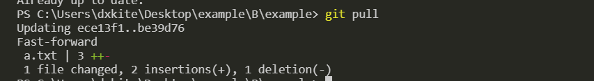

本文内容主要讲解 `Git` 的简单使用，包括：创建本地代码仓库、克隆仓库、提交代码、代码合并、冲突解决

<!-- more -->

## 创建仓库与克隆

Git中，代码都是通过一个个仓库（`repository`）存储的，仓库中包含了代码的版本历史，代码的版本信息等等，通常我们会使用 `Github` 来创建一个远程仓库，复制一份远程仓库（克隆）到本地，修改代码之后再提交上去，整个开发的流程应该是这样的：

1. 建立代码仓库
2. 克隆代码到本地
3. 修改代码
4. 提交代码到本地工作区
5. 提交代码到远程仓库

其中 `3 ~ 5` 就是整个代码的迭代过程，在这个过程中我们的代码越来越完善。
在Git中，我们创建一个本地仓库使用 `init` 命令，其中本地仓库分为两种类型，一种是我们开发的时候使用的版本库（包含工作区），另一个就是用来存储代码的版本库。我们先创建一个版本库，用来存储代码，我们在本地创建一个代码仓库当作远程仓库：


现在假设我是小A，需要写代码，这时我们使用 `clone` 命令将代码复制到本地：


现在，在代表小A的文件夹下，有了一份代码。

## 提交代码

现在小A往代码库里添加了一个文件 `a.txt`，并在其中写道：

```
i am A, this is ture code
```

并把代码提交到本地版本库中。通过命令 `git status` 我们可以看到工作区有个未跟踪历史的文件：



使用 `git add` 命令把文件加入跟踪历史：



通过这样的命令，`a.txt` 文件就被加入到版本历史了，我们要为本次代码操作写个备注,通过 `git commit` 对文件改动进行备注：


使用 `git log` 我们可以看到备注的历史以及提交者和提交时间等等信息，注意，这个提交时提交在本地的，我们查看一下代码库的历史：



可以看到没有提交历史。

## 提交代码到仓库

我们通过使用命令 `git push` 将代码推送到代码库中。



提交之后，我们可以看到代码历史。现在小B和小A一起协同开发，小B把代码克隆到本地后发现，小A的代码写错了一点，于是对他进行了修改：


修改之后，小B做了一个提交，提交到服务器。


从服务器的历史我们可以看到代码提交上去了，小B通知了小A他的代码改过了，需要更新。

## 更新远程代码

小A通过命令 `git pull` 更新了他的代码，并在代码中写入了： `thank for B`，并做了提交。



而这时的小B也在代码里写入了一行 `i am B`，并做了提交，还发送到了远程服务器。



现在B的 `a.txt` 文件的内容：

```
i am A, this is true code
i am B,
```

现在A的文件的内容：

```
i am A, this is true code
thank for B
```

当A做了提交，并上传到服务的时候，服务器拒绝了他，并告诉他他的代码不是最新版本，需要同步服务器的才能更新。



## 冲突解决

小A通过命令 `git pull` 同步了服务器的代码，但是由于小A和小B都修改了`a.txt`且修改的都是第二行，`git` 不知道这个第二行谁是对的，所以自动合并失败，提示手动合并，小A打开了冲突的 `a.txt` 文件发现了如下内容：

```
i am A, this is true code
<<<<<<< HEAD
thank for B
=======
i am B,
>>>>>>> ece13f1f506a58e7b735242c428993ed279b6d95
```

对于第二行我们有两个版本，一个是`HEAD`版本，也就是我们当前的版本，一个是 `ece13f1f506a58e7b735242c428993ed279b6d95` 版本，也就是小B提交过来的版本，小A对于这两个版本都采取了保留的措施。

```
i am A, this is true code
thank for B
i am B,
```

并做了提交。


小B准备写代码了，但是他有一个好习惯，每次写之前都会同步最新的代码，所以他获得了最新的代码版本。


