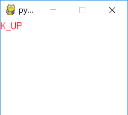
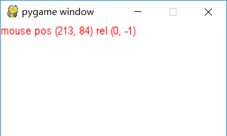

一个游戏不仅仅要能够显示出画面啊，还得接受事件并处理不是么，本次显示一波事件

<!-- more -->

## 处理退出事件

现在开始，游戏的界面都是死循环了，得退出一波，先创建一个标志位，表示游戏正在运行，事件处理流程：

1. 游戏死循环
2. 获取事件流
3. 处理事件流

实现代码：

```python
import pygame 
# 1. 先初始化游戏框架
pygame.init()
# 2. 创建一个窗口
screen = pygame.display.set_mode((200,150),0,32)
# 加载字体 (使用系统字体)
font = pygame.font.SysFont('arial', 16)
# 运行标志
running = True
# 1. 游戏死循环
while running:
    # 2. 获取事件流
    for event in pygame.event.get():
        # 3. 处理事件流
        if event.type == pygame.QUIT:
            print('quit game')
            # 结束运行
            running = False
    # 2.1 屏幕填充白色
    screen.fill((0xff,0xff,0xff))
    # 2.3 渲染文字
    text = font.render("Hello World" ,True,(0xff,0,0))
    # 2.4 贴图文字
    screen.blit(text,(0,0))
    # 3. 刷新显示窗口
    pygame.display.flip()  

# 4. 退出框架
pygame.quit()
```

## 处理键盘事件 

键盘事件的类型为 `KEYDOWN` 或者 `KEYUP`， 我们使用的时候一般使用 `KEYDOWN` 作为触发点：
本程序实例将监控上下左右键，并显示在屏幕上

```python
import pygame 
from pygame import K_UP,K_DOWN,K_LEFT,K_RIGHT,QUIT,KEYDOWN

# 1. 先初始化游戏框架
pygame.init()
# 2. 创建一个窗口
screen = pygame.display.set_mode((200,150),0,32)
# 加载字体 (使用系统字体)
font = pygame.font.SysFont('arial', 16)
# 运行标志
running = True
# 案件方向
text  = 'No Key Event'
# 1. 游戏死循环
while running:
    # 2. 获取事件流
    for event in pygame.event.get():
        text = 'No Key Event'
        # 3. 处理事件流
        if event.type == QUIT:
            # 结束运行
            running = False
        elif event.type == KEYDOWN:
            # 键盘按下事件
            if event.key == K_UP:
                text = 'K_UP'
            elif event.key == K_DOWN:
                text = 'K_DOWN'
            elif event.key == K_LEFT:
                text = 'K_LEFT'
            elif event.key == K_RIGHT:
                text = 'K_RIGHT'
    # 2.1 屏幕填充白色
    screen.fill((0xff,0xff,0xff))
    # 2.3 渲染文字
    text_surface = font.render(text,True,(0xff,0,0))
    # 2.4 贴图文字
    screen.blit(text_surface,(0,0))
    # 3. 刷新显示窗口
    pygame.display.flip()  

# 4. 退出框架
pygame.quit()
```

测试：



### 说明：

监控事件，当事件为键盘按下时，判断键盘按下的值是什么，并显示在屏幕表面上

## 处理鼠标事件

鼠标事件包括了鼠标移动，左键右键中键的监听，事件类型为 `MOUSEMOTION`,`MOUSEBUTTONUP`,`MOUSEBUTTONDOWN` 三种

| 属性  | 说明 |
|-------|-----|
| type |  `MOUSEMOTION`,`MOUSEBUTTONUP`,`MOUSEBUTTONDOWN` |
| pos | 鼠标位置 |
| rel | 相对位置 |

*示例代码*

```python
import pygame 
from pygame import K_UP,K_DOWN,K_LEFT,K_RIGHT,QUIT,MOUSEMOTION,MOUSEBUTTONUP,MOUSEBUTTONDOWN

# 1. 先初始化游戏框架
pygame.init()
# 2. 创建一个窗口
screen = pygame.display.set_mode((300,150),0,32)
# 加载字体 (使用系统字体)
font = pygame.font.SysFont('arial', 16)
# 运行标志
running = True
# 案件方向
mouse  = (0,0)
mouse_move = (0,0)
mouse_key = None
text = 'No Event'

# 1. 游戏死循环
while running:
    # 2. 获取事件流
    for event in pygame.event.get():
        # 3. 处理事件流
        if event.type == QUIT:
            # 结束运行
            running = False
        elif event.type == MOUSEMOTION:
            mouse = event.pos
            mouse_move = event.rel
            text = 'mouse pos %s rel %s ' % (str(mouse),str(mouse_move))
        elif event.type == MOUSEBUTTONUP:
            mouse = event.pos
            mouse_key = event.button 
            text = 'mouse pos %s button %s' % (str(mouse),str(mouse_key))
        elif event.type == MOUSEBUTTONDOWN:
            mouse = event.pos
            mouse_key = event.button 
            text = 'mouse pos %s button %s' % (str(mouse),str(mouse_key))

    # 2.1 屏幕填充白色
    screen.fill((0xff,0xff,0xff))
    # 2.3 渲染文字
    text_surface = font.render(text,True,(0xff,0,0))
    # 2.4 贴图文字
    screen.blit(text_surface,(0,0))
    # 3. 刷新显示窗口
    pygame.display.flip()  

# 4. 退出框架
pygame.quit()
```

*运行截图*

