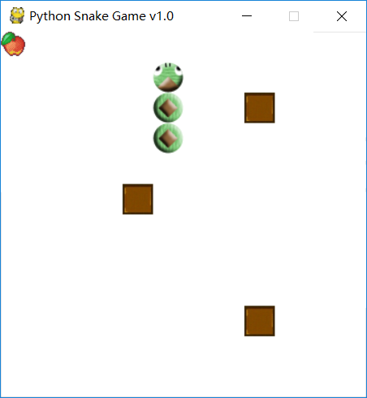

前面我们完成了贪吃蛇的绘制和移动，本节将随机生成砖块和食物
<!-- more -->

生成砖块和食物的规则很简单：

1. 不能在已经有食物的地方生成任何块
2. 已经生成砖块和食物的地方不能生成
3. 不能生成在蛇身上

根据这个规则，我们在游戏视图中写入这些规则，随机生成食物和砖块，如果方块产生了重叠则递归再次生成

```python
# 随机生成地图坐标
def _random(self):
    return (random.randrange(0, self.w), random.randrange(0, self.h))

# 随机生成无冲突坐标
def _get_random_block(self):
    block = self._random()
    for pos in self.snake.body:
        if pos[0] == block[0] and pos[1] == block[1]:
            return self._get_random_block()
    for pos in self._block:
        if pos[0] == block[0] and pos[1] == block[1]:
            return self._get_random_block()
    if block[0] == self._food[0] and block[1] == self._food[1]:
        return self._get_random_block()
    return block 
```

生成砖块和食物后，我们将他绘制到地图上

```python
def on_draw(self):
    self.snake.on_draw(self)
    self.draw_surface(self._food, self.food)
    for block in self._block:
        self.draw_surface(block, self.block)
```

运行后代码：https://github.com/DXkite/python-snake-game-demo/tree/master/09-snake-food-and-block

