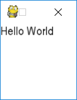

> 实训果然是实训不是实习，钱都没有，还给人洗脑
> 培训机构学不到什么东西的，就算充钱了也不会变强。

开启一个系列，因为每天都要水一篇文章，有技术就分享，没技术就水基础教程，先水一个贪吃蛇

<!-- more -->

我记得我14年的时候就写过了，贪吃蛇，那个时候还是用C语言写的，字符界面，大概长这样：


*图片截自百度，啊鱼的贪吃蛇*

实训没想到第一个就是贪吃蛇，也没啥意思，入门编程的第一个目标游戏，也没毛病，开始BB。

## 第一步：先把pygame装了

使用命令：`pip install pygame` ，把 Pygame 装到自己的机子上

**假装截了图**

## 第二步：显示一个界面

使用Pygame的套路很多，这里就将一个普遍的套路写下来，一般游戏框架的套路基本上是：

1. 先初始化游戏框架
2. 创建一个窗口
3. 刷新显示窗口
4. 退出框架

现在我们按照这个套路来写 pygame 的基本操作，创建一个窗口先：

```python
import pygame
# 1. 先初始化游戏框架
pygame.init()
# 2. 创建一个窗口
screen = pygame.display.set_mode((100,100),0,32)
# 3. 刷新显示窗口
pygame.display.flip()  
# 假装进行了什么操作 （延时2秒）
pygame.time.wait(2000)
# 4. 退出框架
pygame.quit()
```

以上代码的功能就是创建一个100*100像素的窗口，并等待2秒

### set_mode 说明
> set_mode(resolution=(0,0), flags=0, depth=0) -> Surface

| 参数 | 说明|
|------|-----|
| resolution | 显示尺寸 |
| flags | 显示控制，0表示无控制 |
| depth | 颜色深度，一般是 32位 |

#### Flag 说明
| 标志 | 说明|
|------|-----|
|pygame.FULLSCREEN | 创建全屏窗口 |
|pygame.DOUBLEBUF  | 双缓冲窗口，推荐与 HWSURFACE 或 OPENGL 使用|
|pygame.HWSURFACE  | 硬件加速，只在 FULLSCREEN 模式下可用 |
|pygame.OPENGL     | 创建一个基于 OpenGL渲染的窗口 |
|pygame.RESIZABLE  | 可缩放的窗口 |
|pygame.NOFRAME    | 创建没有边界和标题栏的窗口 |

## 第三步：显示文字

基本流程：

1. 加载字体，创建字体对象
2. 显示文字

代码：

```python
import pygame

# 1. 先初始化游戏框架
pygame.init()
# 2. 创建一个窗口
screen = pygame.display.set_mode((100 , 100 ),0,32)
# 2.1 屏幕填充白色
screen.fill((0xff,0xff,0xff))
# 2.2 加载字体 (使用系统字体)
font = pygame.font.SysFont('arial', 16)
# 2.3 渲染文字
text = font.render("Hello World",True,(0,0,0))
# 2.4 贴图文字
screen.blit(text,(0,0))
# 3. 刷新显示窗口
pygame.display.flip()  
# 假装进行了什么操作 （延时2秒）
pygame.time.wait(2000)
# 4. 退出框架
pygame.quit()
```

代码运行效果

