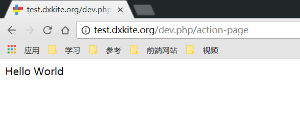
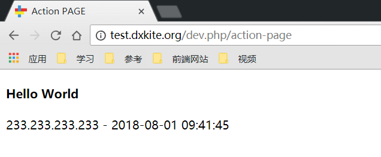

本例将学习创建个动态页面以及学习日志的查看和使用。

<!-- more -->

## MVC模式说明

在Web开发中，用的比较多的方式就是分层设计，最常用的分层模式便是 MVC模式（Model View Controller）

- `Model` 层：业务模型层，处理业务规则
- `View` 层：交互界面层，用户看到并与之交互的界面
- `Controller` 层：接受用户的输入并调用模型和视图去完成用户的需求

> Any problem  in computer science can be solved by anther layer of indirection.
> 计算机科学领域的任何问题都可以通过增加一个间接的中间层来解决
> --- 某大佬

## 框架的分层

在框架中，分层模式不明显也不强调，按照自己的思路来编写代码也可，不过推荐按照一定的规则来对操作进行分层，方便自己也方便他人，一般来说我写代码的时候会分层如下几层

- `Response` 层：对应 MVC 分层中的控制器层，控制界面显示处理业务逻辑
- `Table` 层：负责控制业务数据持久化数据的操作
- `Model` 层：负责对业务逻辑的处理以及使用Table层对数据持久化
- `Controller` 层：负责数据处理以及调用模型
- `Provider` 层：提供对外API的映射以及构建以及权限验证

当业务逻辑不复杂的时候我会把 `Model` 和 `Table` 层合并做 `Table` 层。既各层级的职能分配如下

- `Response` 层：对应 MVC 分层中的控制器层，控制界面显示处理业务逻辑
- `Table` 层：负责对业务逻辑的处理、数据的持久化数据的操作
- `Controller` 层：负责数据处理以及调用模型
- `Provider` 层：提供对外API的映射以及构建以及权限验证

## 创建一个动态页面

在上一次课中我们创建了一个静态页面，我们现在创建一个动态页面，该页面实现功能如下：显示请求的IP地址和时间。记录一条info日志。并记录运行时长。

### 步骤一：先建一条路由

打开上节课的路由文件，添加一条路由。

```json
{
    "index": {
        "class": "cn\\atd3\\response\\IndexResponse",
        "url": "\/"
    },
    "hello": {
        "url": "\/hello",
        "template": "hello"
    },
    "action_page": {
        "url": "\/action-page",
        "class": "cn\\atd3\\response\\ActionPageResponse"
    }
}
```

其中 `action_page` 为本次我们创建的页面路由，该路由会在用户访问 `/action-page` 是调用 `cn\atd3\response\ActionPageResponse` 类。


### 步骤2：创建路由类

在Suda框架中，推荐使用类来代替传统的从头到尾的脚本，不清楚的可以参考 ：[PHP类参考](http://php.net/manual/zh/language.oop5.php) ，在框架中，处理请求的类为 `suda\core\Request`，处理响应的类为 `suda\core\Response` ，本课我们使用响应类来处理请求，这个类是一个抽象类，需要继承；

打开 `src` 文件夹，在文件夹下创建一个文件 `ActionPageResponse.php` ，这个文件会在加载 `cn\atd3\response\ActionPageResponse` 类的时候自动被包含，其中 `src` 的根命名空间为 `cn\atd3\response` 也就是说，框架加载类中包含 `cn\atd3\response\类名` 都是在这个文件夹中搜索。

现在的目录结构如下：


现在我们在里面编写代码：

```php
<?php
namespace cn\atd3\response;

use suda\core\Request;

class ActionPageResponse extends \suda\core\Response
{
    public function onRequest(Request $request)
    {
        echo 'Hello World';
    }
}
```
 
访问页面可以得到如下结果：



### 步骤3：使用模板

创建一个新的模板文件，命名为 action-page (对应的路径为 resource/template/default/action-page.tpl.html)
并写入代码：

```html
<!DOCTYPE html>
<html lang="en">
<head>
    <meta charset="UTF-8">
    <meta name="viewport" content="width=device-width, initial-scale=1.0">
    <meta http-equiv="X-UA-Compatible" content="ie=edge">
    <title>Action PAGE</title>
</head>
<body>
    <h4>Hello World</h4>
</body>
</html>
```

### 步骤4：引入模板并显示

修改  `ActionPageResponse.php` 加入如下代码

```php
$view = $this->page('action-page'); // 创建一个页面并使用 action-page.tpl.html 作为模板
$view->render();  // 渲染模板显示出来
```
现在的代码以及文件结构如下：


访问，得到如下结果


### 步骤5：插入动态变量

修改页面代码：

```php
$view = $this->page('action-page'); // 创建一个页面并使用 action-page.tpl.html 作为模板
$view->set('ip',$request->ip()); // 获取IP并压入模板
$view->set('time',date('Y-m-d H:i:s',time())); // 压入时间
$view->render();  // 渲染模板显示出来
```

修改模板代码：

```html
<h4>Hello World</h4>
<p> {{ $:ip }} - {{ $:time }}</p>
```

其中 `{{ }}` 表示是一个动态参数，`$:ip` 表示使用模板中的变量 `ip` , 使用 `$:` 来与 PHP变量符号 `$` 区分。

现在的页面结构如下：


访问后




### 步骤6：插入日志并查看

```php
debug()->info('日志信息');
```


日志文件路径：`app/data/logs/latest.log`，日志不会自动删除，在日志文件大于 2M 时会被压缩打包，

日志文件内容：


日志摘录

```
=====9744c0=====233.233.233.233=====debug=====
233.233.233.233	2018-08-01 09:44:36	GET	/action-page
	[0.0157389641 s : 438.27 KB]	[trace]	[D:\Server\vhost\dxkite.org\test\suda\system\src\suda\core\System.php:58]		suda\core\System#init	system init
	[0.0169818401 s : 546.16 KB]	[trace]	[D:\Server\vhost\dxkite.org\test\suda\system\src\suda\core\System.php:111]		suda\core\System#readManifast	reading manifast file
	[0.0177240372 s : 548.71 KB]	[trace]	[D:\Server\vhost\dxkite.org\test\suda\system\src\suda\core\System.php:104]		suda\core\System#console	loading application suda\core\Application from D:\Server\vhost\dxkite.org\test\public/../app
	[0.0193159580 s : 648.66 KB]	[trace]	[D:\Server\vhost\dxkite.org\test\suda\system\src\suda\core\Application.php:81]		suda\core\Application#__construct	application load D:\Server\vhost\dxkite.org\test\public/../app
	[0.0219209194 s : 650.99 KB]	[trace]	[D:\Server\vhost\dxkite.org\test\suda\system\src\suda\core\Application.php:525]		suda\core\Application#registerModule	load module config D:\Server\vhost\dxkite.org\test\suda\system\resource\modules/dxkite-suda/module.json
	[0.0254838467 s : 884.95 KB]	[trace]	[D:\Server\vhost\dxkite.org\test\suda\system\src\suda\core\Application.php:525]		suda\core\Application#registerModule	load module config D:\Server\vhost\dxkite.org\test\app\modules/app/module.json
	[0.0263028145 s : 887.67 KB]	[trace]	[D:\Server\vhost\dxkite.org\test\suda\system\src\suda\core\Application.php:337]		live modules	["demo\/app:1.0.0-dev","dxkite\/suda:1.0.6"]
	[0.0268199444 s : 887.74 KB]	[trace]	[D:\Server\vhost\dxkite.org\test\suda\system\src\suda\core\Hook.php:31]		suda\core\Hook#loadConfig	D:\Server\vhost\dxkite.org\test\app\modules/app/resource/config/listener.json
	[0.0278959274 s : 889.52 KB]	[info]	[D:\Server\vhost\dxkite.org\test\suda\system\src\suda\template\Manager.php:117]		suda\template\Manager#theme	change themes:default
	[0.0285499096 s : 913.83 KB]	[trace]	[D:\Server\vhost\dxkite.org\test\suda\system\src\suda\tool\Command.php:49]		suda\tool\Command#exec	exec command {closure command} with args []
	[0.0288488865 s : 913.8 KB]	[trace]	[D:\Server\vhost\dxkite.org\test\suda\system\src\suda\tool\Command.php:49]		suda\tool\Command#exec	exec command {closure command} with args []
	[0.0291199684 s : 912.6 KB]	[info]	[D:\Server\vhost\dxkite.org\test\suda\system\suda.php:7]		suda\core\System#run	process init application 0.013243s
	[0.0294208527 s : 914.97 KB]	[trace]	[D:\Server\vhost\dxkite.org\test\suda\system\src\suda\core\Application.php:365]		reachable modules	["demo\/app:1.0.0-dev"]
	[0.0296499729 s : 915.11 KB]	[trace]	[D:\Server\vhost\dxkite.org\test\suda\system\src\suda\core\Router.php:71]		suda\core\Router#load	load module:demo/app:1.0.0-dev path:D:\Server\vhost\dxkite.org\test\app\modules/app
	[0.0316369534 s : 998.84 KB]	[trace]	[D:\Server\vhost\dxkite.org\test\suda\system\src\suda\core\Router.php:76]		suda\core\Router#load	loading simple route from file D:\Server\vhost\dxkite.org\test\app\modules/app/resource/config/router.json
	[0.0341479778 s : 999.81 KB]	[info]	[D:\Server\vhost\dxkite.org\test\suda\system\suda.php:7]		suda\core\System#run	process init router 0.004893s
	[0.0343270302 s : 1003.75 KB]	[trace]	[D:\Server\vhost\dxkite.org\test\suda\system\src\suda\tool\Command.php:49]		suda\tool\Command#exec	exec command {closure command} with args [{}]
	[0.0345048904 s : 1000.93 KB]	[info]	[D:\Server\vhost\dxkite.org\test\suda\system\src\suda\core\System.php:85]		suda\core\Router#dispatch	process dispatch 0.000221s
	[0.0353410244 s : 1.02 MB]	[trace]	[D:\Server\vhost\dxkite.org\test\suda\system\src\suda\core\Application.php:383]		suda\core\Application#activeModule	active module demo/app:1.0.0-dev
	[0.0356998444 s : 1.02 MB]	[trace]	[D:\Server\vhost\dxkite.org\test\suda\system\src\suda\core\Application.php:389]		suda\core\Application#activeModule	set locale zh-CN
	[0.0377128124 s : 1.02 MB]	[trace]	[D:\Server\vhost\dxkite.org\test\suda\system\src\suda\tool\Command.php:97]		parse command cn\atd3\response\ActionPageResponse->onRequest	["cn\\atd3\\response\\ActionPageResponse->onRequest","cn\\atd3\\response\\ActionPageResponse","->","onRequest"]
	[0.0388419628 s : 1.04 MB]	[trace]	[D:\Server\vhost\dxkite.org\test\suda\system\src\suda\tool\Command.php:49]		suda\tool\Command#exec	exec command cn\atd3\response\ActionPageResponse->onRequest with args [{}]
	[0.0427668095 s : 1.05 MB]	[info]	[D:\Server\vhost\dxkite.org\test\suda\system\src\suda\template\Manager.php:133]		suda\template\compiler\suda\Compiler#compile	process compile demo/app:1.0.0-dev:action-page 0.001639s
	[0.0445339680 s : 1.09 MB]	[info]	[D:\Server\vhost\dxkite.org\test\app\modules\app\src\ActionPageResponse.php:13]		cn\atd3\response\ActionPageResponse#onRequest	日志信息
	[0.0446398258 s : 1.09 MB]	[trace]	[D:\Server\vhost\dxkite.org\test\suda\system\src\suda\template\compiler\suda\Template.php:99]		start render	demo/app:1.0.0-dev:action-page
	[0.0447850227 s : 1.11 MB]	[info]	[D:\Server\vhost\dxkite.org\test\suda\system\src\suda\template\compiler\suda\Template.php:91]		suda\template\compiler\suda\Template#echo	process render demo/app:1.0.0-dev:action-page 0.000047s
	[0.0448758602 s : 1.09 MB]	[trace]	[D:\Server\vhost\dxkite.org\test\suda\system\src\suda\template\compiler\suda\Template.php:107]		free render [348]	demo/app:1.0.0-dev:action-page
	[0.0449628830 s : 1.09 MB]	[trace]	[D:\Server\vhost\dxkite.org\test\suda\system\src\suda\template\compiler\suda\Template.php:59]		suda\template\compiler\suda\Template#render	echo demo/app:1.0.0-dev:action-page
	[0.0454258919 s : 1.07 MB]	[info]	[D:\Server\vhost\dxkite.org\test\suda\system\src\suda\core\Router.php:336]		suda\core\Router#runRouter	process request 0.007781s
	[0.0455188751 s : 1.07 MB]	[info]	[D:\Server\vhost\dxkite.org\test\suda\system\src\suda\core\System.php:85]		suda\core\Router#dispatch	process run router 0.010214s
	[0.0456018448 s : 1.07 MB]	[info]	[D:\Server\vhost\dxkite.org\test\suda\system\suda.php:7]		suda\core\System#run	process run request 0.011327s
	[0.0458300114 s : 1.07 MB]	[info]	[D:\Server\vhost\dxkite.org\test\suda\system\src\suda\core\System.php:140]		suda\core\Debug#timeEnd	process before shutdown 0.000111s
	[0.0466220379 s : 1.09 MB]	[info]	[D:\Server\vhost\dxkite.org\test\suda\system\src\suda\core\System.php:150]		suda\core\Cache#gc	process cache gc 0.000109s
	[0.0467770100 s : 1.09 MB]	[trace]	[D:\Server\vhost\dxkite.org\test\suda\system\src\suda\tool\Command.php:49]		suda\tool\Command#exec	exec command {closure command} with args []
	[0.0469088554 s : 1.09 MB]	[trace]	[D:\Server\vhost\dxkite.org\test\suda\system\src\suda\core\System.php:152]		suda\core\System#onShutdown	connection status normal
	[0.0470139980 s : 1.09 MB]	[trace]	[D:\Server\vhost\dxkite.org\test\suda\system\src\suda\core\System.php:155]		suda\core\System#onShutdown	system shutdown
	[0.0471739769 s : 1.09 MB]	[info]	[D:\Server\vhost\dxkite.org\test\suda\system\src\suda\core\System.php:156]		suda\core\Debug#timeEnd	process shutdown 0.001214s
	[0.0473518372 s : 1.09 MB]	[info]	[D:\Server\vhost\dxkite.org\test\suda\system\src\suda\core\Debug.php:406]		suda\core\Debug#afterSystemRun	process system 0.032624s
=====9744c0=====0.0475850105=====1.0871 MB:1.5067 MB=====22:23.916 MB=====
```

格式说明

```
=====请求指纹=====IP地址=====运行模式=====
请求IP	请求时间	请求方法	请求路径
    [运行时间: 内存消耗]	[日志等级]	[文件位置]		调用函数	信息内容
=====请求指纹=====运行时间=====消耗内存:最高内存消耗=====秒并发:并发消耗=====
```


## 作业：

编写一个自己的动态页面，内容与示例不同
