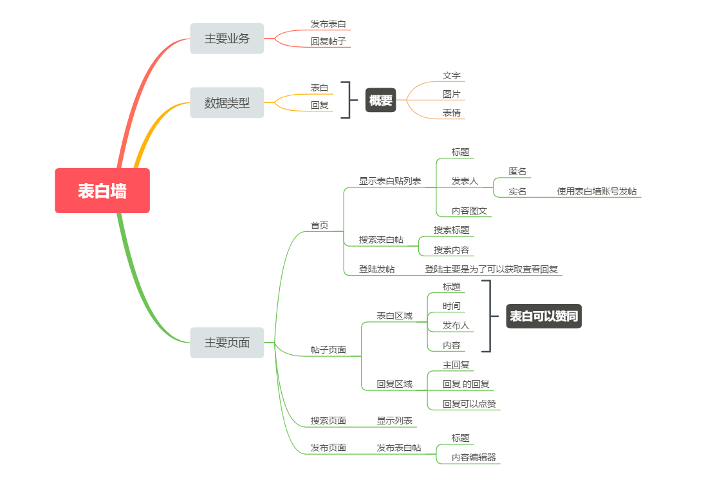

接下来的时间，我们来尝试自己写一个表白墙，我们来思考一下表白墙的功能？

<!-- more -->

## 需求思考

- 表白墙需要发送帖子，这个帖子可能包括了图片、表情、文字
- 发送的表白帖子可以被点赞
- 自己可以删除自己的表白帖
- 界面可能要长的好看点
- 表白帖子的内容是可以评论的
- 评论可以点赞

根据上面的简单需求，我们可以整理下我们自己的思路

这些就是我们大概的一个功能，思考一下路由：

## 路由的设计

- 应用路由
    - index 显示表白帖子
    - search 显示搜索表白内容的帖子
    - confession 显示表白内容的帖子，包括评论
    - write 写表白帖子的页面
    - repot 举报表白帖
- 管理路由
    - admin_list 显示表白帖

        具体功能
        - view 查看帖子
        - delete 删除表白帖
        - search 搜索帖子
        - close 关闭帖子回复
    
emmm，貌似多了一个，举报，毕竟没有审核的表白帖，还是加一个举报功能的好

## 模块化

表白墙的功能比较简单，就一个模块就好，本次我们专注表白墙功能的开发，引入一下我写的模块

- support 模块 [下载](suda-confession-wall-design/dxkite-support.18.08.13.mod)

    提供了基础文件上传、数据维护、网站维护、权限系统等功能
- user 模块 [下载](suda-confession-wall-design/dxkite-user.18.08.13.mod)

    基于support模块开发的，提供了用户登陆注册等功能
- content-parser 模块 [下载](suda-confession-wall-design/dxkite-content-parser.18.08.13.mod)

    提供内容的处理，目前支持markdown处理和html以及纯文本处理

## 可能的功能

富文本编辑器（提供文本，表情、图片内容编辑的功能），在后续开发中找一个。。。

## 作业

- 添加好路由
- 安装好模块，使用户模块能够正常运行
