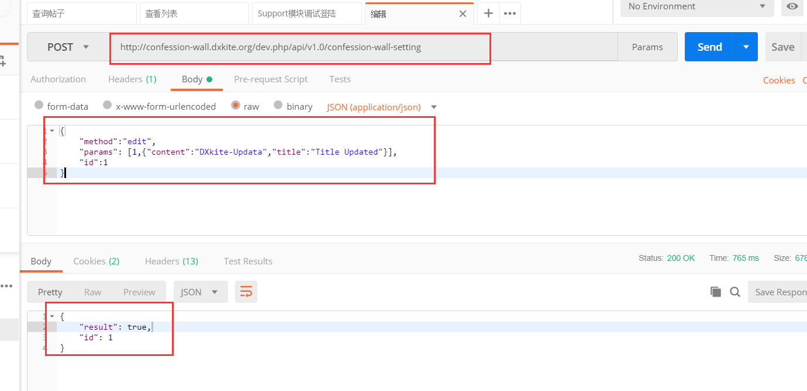

前面我们讲了列出表白的内容，这次我们讲如何编辑以及删除，在框架的模式下，对数据表的`CRUD`非常的简单，特别是你按照自己的套路来写的时候那就更加的简单了。

<!-- more -->

## 编辑功能

管理员编辑表白的内容，现有的情况下可以编辑标题、内容，编辑的方式当然还是通过表白的id来编辑嘛，首先我们的表白内容编辑得有个权限：`confession-wall.edit`，那么在 `ConfessionSettingProvider` 类中映射出的函数的声明如下：

```php
    /**
     * 编辑内容
     * 
     * @acl confession-wall.edit
     * @param integer $id
     * @param array $value
     * @return boolean
     */
    public function edit(int $id,array $value):bool {
        
    }
```

由于操作十分原始，我们这里就不再在Controller中加入编辑的方法了（想加还是可以加），我们直接引入数据表来操作，操作的时候对输入进行处理：

```php
    /**
     * 编辑内容
     *
     * @acl confession-wall.edit
     * @param integer $id
     * @param array $value
     * @return boolean
     */
    public function edit(int $id, array $value):bool
    {
        $table = new ConfessionTable;
        if (array_key_exists('title', $value)) {
            $sets['title']=$value['title'];
        }
        if (array_key_exists('content', $value)) {
            $sets['content']=$value['content'];
        }
        return $table->updateByPrimaryKey($id,$sets) > 0;
    }
```

### 测试

发送包：`dev.php/api/v1.0/confession-wall-setting`
```json
{
	"method":"edit",
	"params": [1,{"content":"DXkite-Updata","title":"Title Updated"}],
	"id":1
}
```
返回值：
```json
{
    "result": true,
    "id": 1
}
```



查询一下：


## 删除功能

**删除不是删除，是将内容置为了删除标识：Why?**

> 采取监测、记录网络运行状态、网络安全事件的技术措施，并按照规定留存相关的网络日志不少于六个月；
> 《中华人民共和国网络安全法》第三章网络运行安全第二十一条第三点

*其实也没啥，就是相当于回收站的作用*

代码：

```php
    /**
     * 删除内容
     * @acl confession-wall.delete
     * @param integer $id
     * @return boolean
     */
    public function delete(int $id):bool {
        $table = new ConfessionTable;
        return $table->updateByPrimaryKey($id,['status' => ConfessionTable::STATUS_DELETE ]) > 0;
    }
```

### 测试

发送包：`dev.php/api/v1.0/confession-wall-setting`

```json
{
	"method":"delete",
	"params": [1],
	"id":1
}
```

响应：

```json
{
    "result": true,
    "id": 1
}
```

## 作业

- 复现