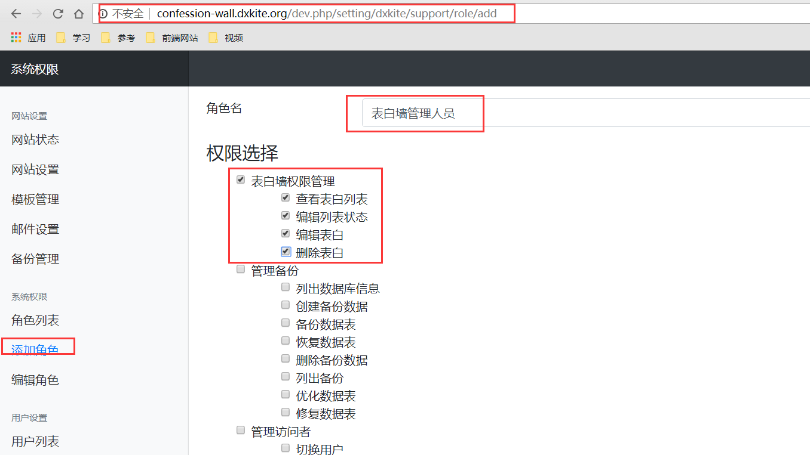
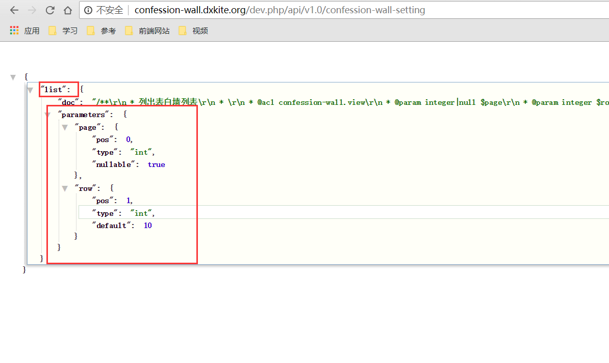
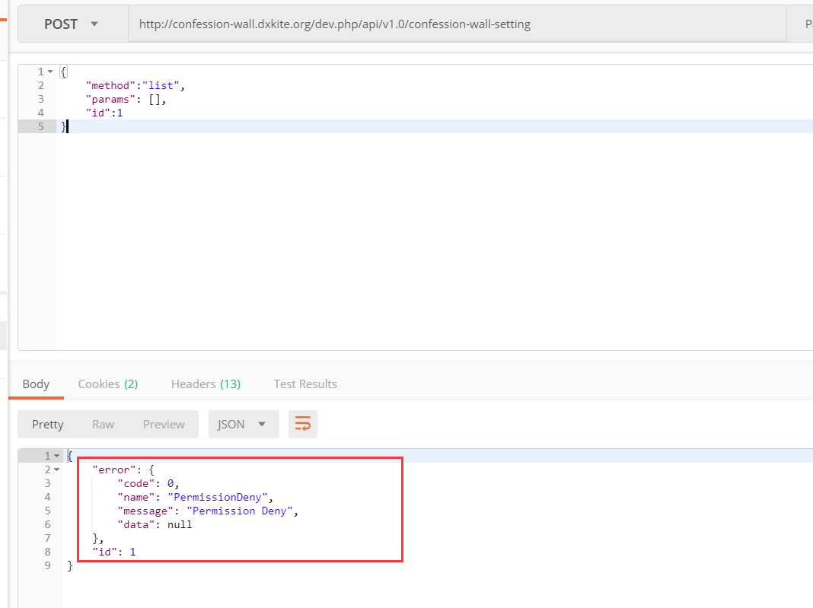

我们基本的功能写的差不多了（什么！就差不多了？？？），现在我们需要添加一个管理功能。

<!-- more -->

## 管理权限

`Support` 模块提供了细粒度的权限管理功能，我们来学习一下如何使用：

### 添加权限列

我们在 `config` 目录下添加一个 `permissions` 配置，如果你用json做配置文件可以这样写：

```json
{
  "confession-wall": {
    "name": "表白墙权限管理",
    "childs": {
      "view": "查看表白列表",
      "status": "编辑列表状态",
      "edit": "编辑表白",
      "delete": "删除表白"
    }
  }
}
```

不过我们现在采用 yaml 做配置文件。

```yml
confession-wall:
  name: 表白墙权限管理
  childs:
    view: 查看表白列表
    status: 编辑列表状态
    edit: 编辑表白
    delete: 删除表白
```

### 添加权限角色

进入后台设置列表：


这里我们权限添加一个角色：



然后给自己添加一下权限（设置->用户列表->权限）：


然后我们现在权限已经加好了。

## 添加管理功能

管理功能我们单独使用一个 `Provider`：

### 查看表白列表

查看列表，这里我们添加一个 Doc 注释，加一个 `@acl` 标注，值为 `confession-wall.view` （刚刚加入的权限配置的权限之一）：

```
    /**
     * 列出表白墙列表
     * 
     * @acl confession-wall.view
     * @param integer|null $page
     * @param integer $row
     * @return array|null
     */
```

这里是仿造Java的Annotation注解的功能

```php
<?php
namespace dxkite\confession\wall\provider;

use dxkite\confession\wall\controller\ConfessionController;

/**
 * 管理表白
 */
class ConfessionSettingProvider
{
    protected $controller;

    public function __construct()
    {
        $this->controller = new ConfessionController;
    }

    /**
     * 列出表白墙列表
     * 
     * @acl confession-wall.view
     * @param integer|null $page
     * @param integer $row
     * @return array|null
     */
    public function list(?int $page, int $row = 10):?array
    {
        $pageData = $this->controller->list($page, $row);
        $pageRows = $pageData['rows']; // 获取到数据字段
        // 检测到需要处理的用户ID
        $userIdMap = [];
        foreach ($pageRows as $index => $pageRow) {
            $userIdMap[$pageRow['user']]=$index;
        }
        // 获取所有用户信息
        $userInfos = get_user_public_info_array(array_keys($userIdMap));
        // 返回到数据列
        foreach ($userInfos as $id => $data) {
            // $userIdMap[$id] == index
            $pageRows[$userIdMap[$id]]['user']=$data;
        }
        // 放回原来的字段
        $pageData['rows'] = $pageRows;
        return $pageData;
    }
}
```

现在我来把 `ConfessionSettingProvider` 映射到API接口列表中：
打开 `api/mapper` 文件（这里是 `api/mapper.yml`）

```yml
v1.0:
  confession-wall: dxkite.confession.wall.provider.ConfessionProvider
  confession-wall-setting: dxkite.confession.wall.provider.ConfessionSettingProvider
```

然后访问：`dev.php/api/v1.0`


可以看到 `confession-wall-setting` 也注册到API中



我们来使用一下这个功能



哎？`PermissionDeny` 没有权限哦，为啥，，，没登陆啊。赶紧登陆一个


登陆后，就可以查看到了我们的权限：

```json
{
    "result": {
        "rows": [
            {
                "id": "1",
                "user": "1",
                "anonymous": "1",
                "title": "DXkite",
                "content": {
                    "type": "markdown",
                    "raw": "DXkite Content",
                    "html": "<p>DXkite Content</p>"
                },
                "time": "1535032422",
                "ip": "127.0.0.1",
                "status": "1"
            },
            {
                "id": "2",
                "user": "1",
                "anonymous": "1",
                "title": "这是我的表白",
                "content": {
                    "type": "markdown",
                    "raw": "匿名状态发布 ",
                    "html": "<p>匿名状态发布</p>"
                },
                "time": "1535032846",
                "ip": "127.0.0.1",
                "status": "1"
            },
            {
                "id": "3",
                "user": "1",
                "anonymous": "1",
                "title": "标题",
                "content": {
                    "type": "markdown",
                    "raw": "内容",
                    "html": "<p>内容</p>"
                },
                "time": "1535037182",
                "ip": "127.0.0.1",
                "status": "1"
            },
            {
                "id": "4",
                "user": {
                    "id": "1",
                    "name": "dxkite",
                    "avatar": "0",
                    "signupTime": "1535032260",
                    "avatarUrl": "http://confession-wall.dxkite.org/dev.php/user/avatar/1"
                },
                "anonymous": "0",
                "title": "不是匿名的表白帖",
                "content": {
                    "type": "markdown",
                    "raw": "表白内容",
                    "html": "<p>表白内容</p>"
                },
                "time": "1535120351",
                "ip": "127.0.0.1",
                "status": "1"
            }
        ],
        "row_size": 4,
        "row_total": 4,
        "page": {
            "max": 1,
            "min": 1,
            "size": 4,
            "current": 1,
            "next": false,
            "previous": false
        }
    },
    "id": 1
}
```

## 作业

**复现**

> 还有删除啥的明天再说了