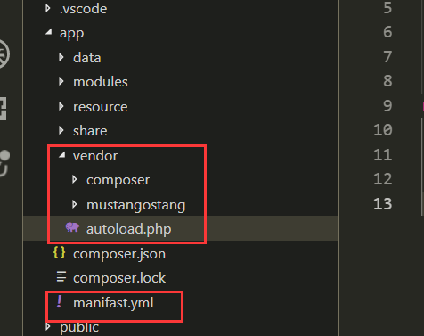
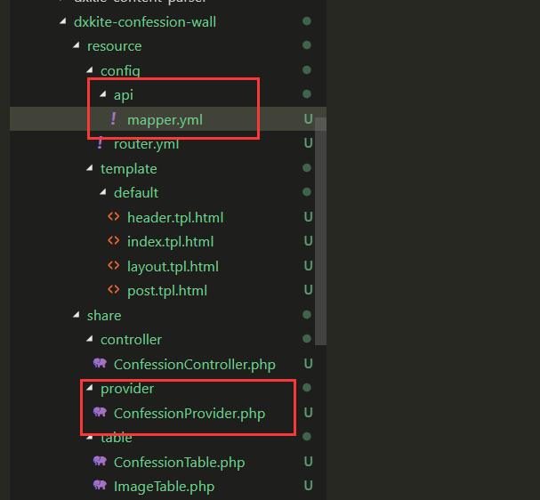
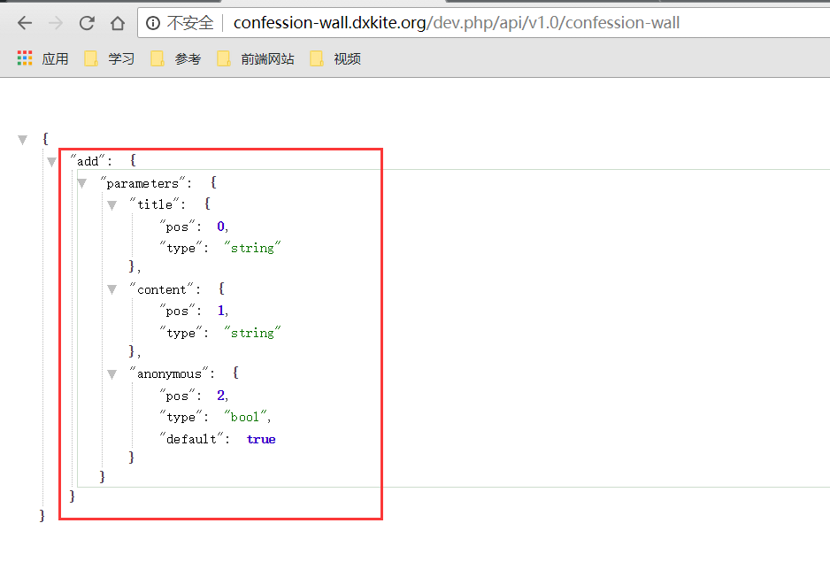
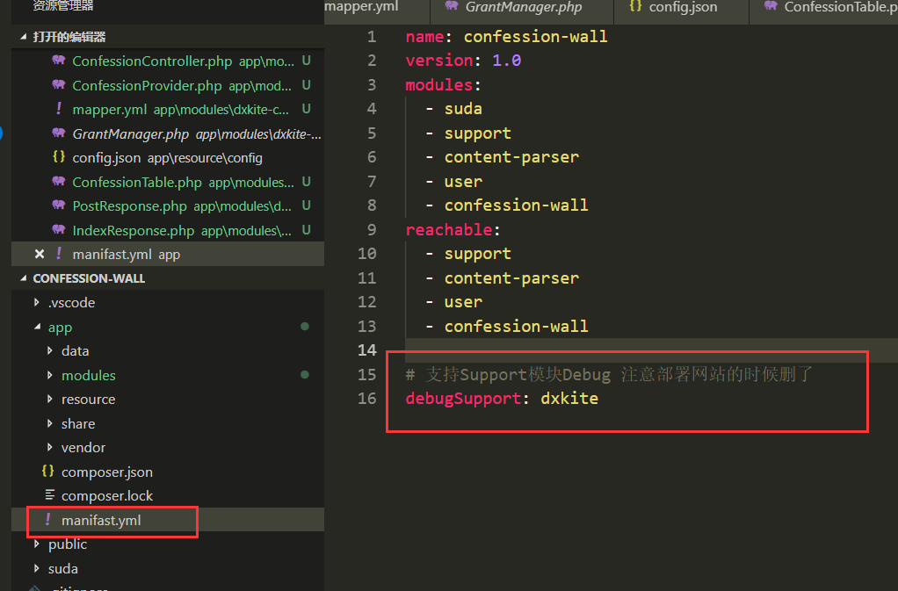
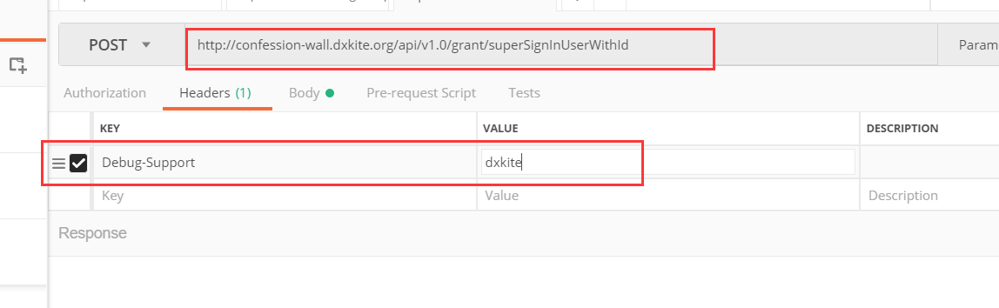
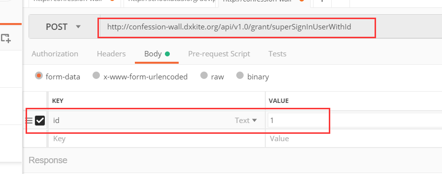
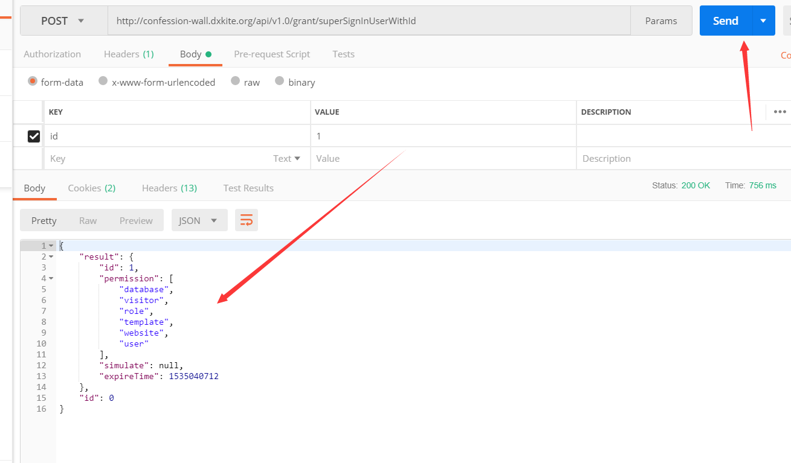
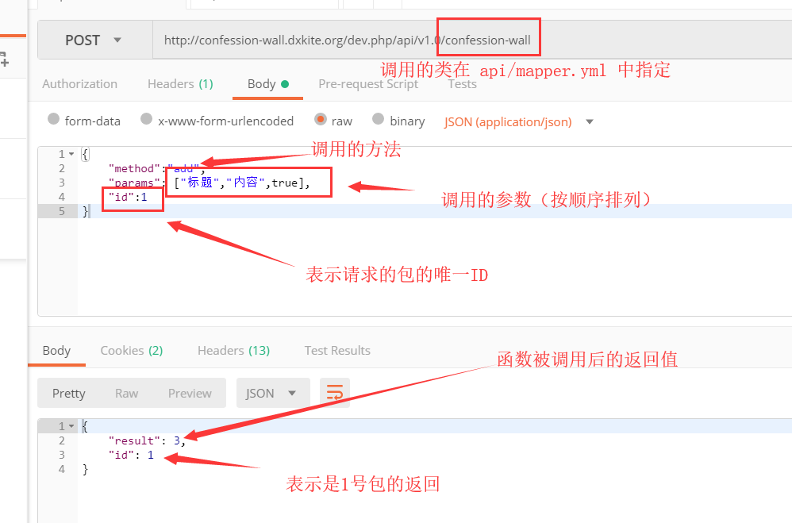

今天的任务主要就是把基本表白帖发布（标题，内容，是否匿名）的功能写了

<!-- more -->

在正式开始之前，加入一个骚东西，使用yaml做配置文件，下载依赖库 [Spyc](suda-confession-wall-simple-action/vendor.zip) 放到 app 目录下，就像这样：



那么在这个app中所有的配置文件都支持yaml做配置，**注意** 保持框架最新，才能体验最新的功能。

## 发帖功能实现

在实现功能之前，我们回忆下基本法，也就是开发规则或者说开发套路，按照我自己开发的习惯，一般套路分配如下：

1. Table 数据表类，用于维护表结构
2. Controller 控制类，用于基于表类进行一系列的操作
3. Response 响应类，提供页面的显示以及调用Controller服务
4. Provider 提供者类，提供基于Support模块的RPC的API服务

按照这个套路，我们发帖这个功能的实现路线如下：

1. POST表单 --> Response 处理 --> Controller 方法 --> Table 方法 --> 数据库
2. RPC方式调用 --> Provider 处理 --> Controller 方法 --> Table 方法 --> 数据库

### 路线1实现：

首先把页面写好，页面中，提供了两个输入框，一个可选框，选择匿名发表


昂，页面代码你们自己写把，我这边给一个我的页面代码：

```html
@extend ('layout') @startInsert('confession-content')
<form action="@u" method="post" class="my-2">
    <div class="form-group row">
        <label for="title" class="col-sm-2 col-form-label">{= 标题 }</label>
        <div class="col-sm-10">
            <input type="text" class="form-control" id="title" name="title">
        </div>
    </div>

    <div class="form-group row">
        <label for="description" class="col-sm-2 col-form-label">{= 具体内容 }</label>
        <div class="col-sm-10">
            <textarea class="form-control" name="content" id="description" rows="3"> </textarea>
        </div>
    </div>

    <div class="form-group row">
        <div class="col-2">
            <button type="submit" class="btn btn-info mb-2" name="action" value="publish">{= 发布 }</button>
        </div>
        <div class="checkbox col">
            <label>
                <input id="anonymous" name="anonymous" type="checkbox" value="true"> {= 匿名发表 }
            </label>
        </div>
    </div>
</form>
@endInsert
```

接下来，我们先写好控制器，就是提供发帖的功能：

```php
<?php
namespace dxkite\confession\wall\controller;

use dxkite\confession\wall\table\ConfessionTable;

/**
 * 处理表白
 */
class ConfessionController
{
    protected $table;

    public function __construct()
    {
        $this->table = new ConfessionTable;
    }

    public function add(string $title, string $content, bool $anonymous=true): int
    {
        return $this->table->insert([
            'user' => get_user_id(),
            'title' => $title ,
            'content' => $content,
            'anonymous' => $anonymous ? 1 :0,
            'time' => time(),
            'ip' => request()->ip(),
            'status' => ConfessionTable::STATUS_NORMAL,
        ]);
    }
}
```

在这里，发布一个帖子就是一句话！插入一条记录，这里我们还是用了一个函数：`get_user_id` ，顾名思义，这个是用来获取用户ID的，用户基本功能是由support模块提供， 然后user模块负责登陆等操作，如果要分布式布置的话，只需要换一个用户模块就可以了。
现在我们需要在响应中处理请求，当接受到POST请求的时候，提取表单的内容并检查是否为空，然后写入到数据库中：

```php
<?php
namespace dxkite\confession\wall\response;

use dxkite\support\visitor\response\VisitorResponse;
use dxkite\support\visitor\Context;
use dxkite\confession\wall\controller\ConfessionController;

class PostResponse extends VisitorResponse
{
    public function onUserVisit(Context $context)
    {
        $view = $this->view('post');
        if (request()->hasPost()) {
            $controller = new ConfessionController;
            $title = request()->post('title');
            $context =  request()->post('content');
            $anonymous = request()->post('anonymous',false) == true ?true:false;
            if ($title && $context) {
                $id = $controller->add($title,$context,$anonymous);
            }
        }
        $view->render();
    }
}
```

我们来看看运行截图：


当我们点击发布以后，会写入到数据库中：


可以看到title字段位正常的，content字段的内容不是我们填的内容，为什么？这个我们之前就说了，看我们的Table类：


这里我们对输入的内容进行了一次处理，用打包模块打包了，然后我们发现时间也不对啊！！怎么是 `1535032846` ？这个是 `Unix`时间表示方式，叫时间戳，表示从 1970年1月1日到现在的时间的秒数了。


### 线路2实现

在线路2中，我们要使用support模块支持的RPC开放功能来实现。首先定义Provider类：

```php
<?php
namespace dxkite\confession\wall\provider;

use dxkite\confession\wall\controller\ConfessionController;

/**
 * 处理表白
 */
class ConfessionProvider
{
    protected $controller;

    public function __construct()
    {
        $this->controller = new ConfessionController;
    }

    public function add(string $title, string $content, bool $anonymous=true): int
    {
        return $this->controller->add($title,$content,$anonymous);
    }
}
```

现在我们利用support库的配置配置 `api/mapper` 文件：



> api/mapper.yml

```yml
v1.0:
  confession-wall: dxkite.confession.wall.provider.ConfessionProvider
```

访问页面： /dev.php/api/v1.0/confession-wall



可以看到有一个接口 `add`

#### 使用接口

这里我使用Postman来调试接口：

 

哎？？好吧，不允许游客发送，那么登陆把：
在调试模式下登陆，我们需要这样，先在app/manifast.yml添加一条配置 debugSupport，值随意，这个是密码：



然后添加一个请求：`api/v1.0/grant/superSignInUserWithId`
设置一个Debug-Support的HTTP头，值为刚刚填的值：



然后在请求参数中写入id为1（用户ID）



点击Send，如果返回的包中id是1的话，表示登陆成功了。



那么返回刚刚的请求，发送：


可以看到，返回了一个整数3，表示刚刚插入的一行的ID为3


那么，使用RPC发送表白帖也成功了。

**说明**

这里包结构采用了RPC2.O协议的包结构并扩展了部分，参考文档： https://github.com/DXkite/APIProxyCall-JavaClient
这里我们的函数只要按照包结构构造调用，就可以用Java、Javascript来远程调用（参考我参与开发的一个APP：https://github.com/TTHHR/code4a ） 里面就是利用了support 模块交互。




### 作业

复现！