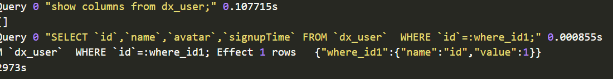
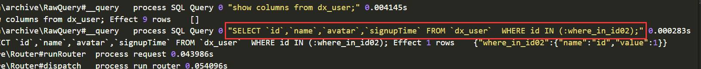

今天的任务挺简单：获取表白内容列表

<!-- more -->

## 套路1

按照昨天的套路，我们应该是先写HTML页面再说，但是在一个成熟的项目团队中，HTML页面将会由前端人员来写，也就是所谓的前后端分离。

先创建一个方法 `list` ，这里我们引用一下 `Support` 模块的 `dxkite\support\view\TablePager` 类，这个类的功能是构建一个分页，也就是我们在网页中常见的下一页的功能的实现。基本参数如下：

```php

/**
 * 表页信息构建
 */
class TablePager
{
    /**
     * 列出指定条件的内容，并进行分页
     *
     * @param Table $table 需要擦好像的表
     * @param [type] $where 查询条件
     * @param array $binder 查询条件值绑定
     * @param integer|null $page 分页
     * @param integer $row 每页书目
     * @return array
     */
    public static function listWhere(Table $table, $where, array $binder, ?int $page, int $row):array
    {
```

通过如上的描述，我们的`ConfessionController`列出函数可以这样写（列出表元素，当状态为：`ConfessionTable::STATUS_NORMAL` 的时候）：

```php
public function list(?int $page, int $row = 10):?array
{
    //  列出表元素，当状态为：ConfessionTable::STATUS_NORMAL 的时候
    return TablePager::listWhere($this->table, ['status' => ConfessionTable::STATUS_NORMAL], [], $page, $row);
}
```

现在我们的 `ConfessionController` 类长这样：

```php
<?php
namespace dxkite\confession\wall\controller;

use dxkite\confession\wall\table\ConfessionTable;
use dxkite\support\view\TablePager; // 引入分页函数类

/**
 * 处理表白
 */
class ConfessionController
{
    protected $table;

    public function __construct()
    {
        $this->table = new ConfessionTable;
    }

    /**
     * 添加表白帖
     *
     * @param string $title
     * @param string $content
     * @param boolean $anonymous
     * @return integer
     */
    public function add(string $title, string $content, bool $anonymous=true): int
    {
        return $this->table->insert([
            'user' => get_user_id(),
            'title' => $title ,
            'content' => $content,
            'anonymous' => $anonymous ? 1 :0,
            'time' => time(),
            'ip' => request()->ip(),
            'status' => ConfessionTable::STATUS_NORMAL,
        ]);
    }


    public function list(?int $page, int $row = 10):?array
    {
        //  列出表元素，当状态为：ConfessionTable::STATUS_NORMAL 的时候
        return TablePager::listWhere($this->table, ['status' => ConfessionTable::STATUS_NORMAL], [], $page, $row);
    }
}
```

**这可能是我最后一次列出全部代码了，毕竟会造成篇幅太长，我可能后期会弄一个工具用来查看文档**

按照昨天的套路，我们如果要接用`support`模块公开api的话，还需要添加到provider类（可能有点繁琐，等会就会讲为什么）,添加到昨天的 `ConfessionProvider` 中去：

```php
public function list(?int $page, int $row = 10):?array
{
    return $this->controller->list($page, $row);
}
```

然后利用Postman来调用这个方法；


可以看到我们的包：

```json
{
	"method":"list",
	"params": [],
	"id":1
}
```

以及返回包：

```json
{
    "result": {
        "rows": [
            {
                "id": "1",
                "user": "1",
                "anonymous": "1",
                "title": "DXkite",
                "content": {
                    "type": "markdown",
                    "raw": "DXkite Content",
                    "html": "<p>DXkite Content</p>"
                },
                "time": "1535032422",
                "ip": "127.0.0.1",
                "status": "1"
            },
            {
                "id": "2",
                "user": "1",
                "anonymous": "1",
                "title": "这是我的表白",
                "content": {
                    "type": "markdown",
                    "raw": "匿名状态发布 ",
                    "html": "<p>匿名状态发布</p>"
                },
                "time": "1535032846",
                "ip": "127.0.0.1",
                "status": "1"
            },
            {
                "id": "3",
                "user": "1",
                "anonymous": "1",
                "title": "标题",
                "content": {
                    "type": "markdown",
                    "raw": "内容",
                    "html": "<p>内容</p>"
                },
                "time": "1535037182",
                "ip": "127.0.0.1",
                "status": "1"
            }
        ],
        "row_size": 3,
        "row_total": 3,
        "page": {
            "max": 1,
            "min": 1,
            "size": 3,
            "current": 1,
            "next": false,
            "previous": false
        }
    },
    "id": 1
}
```

就目前来说，我们构建的包好像没有参数？为什么？因为这个list函数的值都是可省略的。（`page` 可为null，`row` 默认为10），在后续的教程中，我们优先开发功能，所以将会先把后端也就是api接口开发完毕后才会开始开发页面。

从返回包来看，我们的页面信息都存储在里面了，但是也有一个问题，我们的ip啊，user啊都在里面！！如果一个稍微懂技术的人员通过这个接口就可以获取表白人的账号和发帖ip这将很危险，所以，在Controller层获取数据之后我们还要进行一次处理。

```php
    public function list(?int $page, int $row = 10):?array
    {
        $pageData = $this->controller->list($page, $row);
        $pageRows = $pageData['rows']; // 获取到数据字段
        foreach ($pageRows as $index => $pageRow ) {
            // 表示匿名状态
            if ($pageRow['anonymous'] == 1) {
                // 清理user的信息
                $pageRow['user'] = 0;
            }
            // 去除IP信息
            unset($pageRow['ip']);
            // 替换原来的列
            $pageRows[$index] = $pageRow;
        }
        // 放回原来的字段
        $pageData['rows'] = $pageRows;
        return $pageData;
    }
```

现在，我们在Provider层处理输出的数据，并去除了敏感信息；继续请求包，看看我们的返回：

```json
{
    "result": {
        "rows": [
            {
                "id": "1",
                "user": 0,
                "anonymous": "1",
                "title": "DXkite",
                "content": {
                    "type": "markdown",
                    "raw": "DXkite Content",
                    "html": "<p>DXkite Content</p>"
                },
                "time": "1535032422",
                "status": "1"
            },
            {
                "id": "2",
                "user": 0,
                "anonymous": "1",
                "title": "这是我的表白",
                "content": {
                    "type": "markdown",
                    "raw": "匿名状态发布 ",
                    "html": "<p>匿名状态发布</p>"
                },
                "time": "1535032846",
                "status": "1"
            },
            {
                "id": "3",
                "user": 0,
                "anonymous": "1",
                "title": "标题",
                "content": {
                    "type": "markdown",
                    "raw": "内容",
                    "html": "<p>内容</p>"
                },
                "time": "1535037182",
                "status": "1"
            }
        ],
        "row_size": 3,
        "row_total": 3,
        "page": {
            "max": 1,
            "min": 1,
            "size": 3,
            "current": 1,
            "next": false,
            "previous": false
        }
    },
    "id": 1
}
```

可以看到，我们的匿名人发表的信息的ID都为0了，然后所以人的IP也都不见了。（PHP语法请熟练）

### 用户信息的具象化

从刚刚我们的返回包可以看到，用户的数据还停留在id这样一个状态，我们现在需要具象化他，先下载好模块，我这个功能也是刚添加好的

- [support](suda-confession-wall-view-list/dxkite-support.8.24.mod)
- [user](suda-confession-wall-view-list/dxkite-user.8.24.mod)

我们现在有两个解决方案：

**方案1**

在处理数据的时候直接查询用户信息，最新的`support`模块提供 `get_user_public_info` 用来获取用户的公开信息（头像，用户名啥的）

```php
    public function list(?int $page, int $row = 10):?array
    {
        $pageData = $this->controller->list($page, $row);
        $pageRows = $pageData['rows']; // 获取到数据字段
        foreach ($pageRows as $index => $pageRow ) {
            // 表示匿名状态
            if ($pageRow['anonymous'] == 1) {
                // 清理user的信息
                $pageRow['user'] = 0;
            }else{
                // 根据ID获取信息
                $pageRow['user'] = get_user_public_info($pageRow['user']);
            }
            // 去除IP信息
            unset($pageRow['ip']);
            // 替换原来的列
            $pageRows[$index] = $pageRow;
        }
        // 放回原来的字段
        $pageData['rows'] = $pageRows;
        return $pageData;
    }
```

在查询出来的结果中我们可以看到


不是匿名的用户的用户信息也有了，但是这个意味着我们一个分页要进行10次作业的SQL查询，还有一个更加好的解决方案。

**方案2**

我们需要使用到 `get_user_public_info_array` 函数，这个函数相当于SQL中的IN语法进行查询的，所以只进行了一次查询，代价也不`昂贵，就是处理数据的逻辑麻烦点：

```php
    public function list(?int $page, int $row = 10):?array
    {
        $pageData = $this->controller->list($page, $row);
        $pageRows = $pageData['rows']; // 获取到数据字段
        // 检测到需要处理的用户ID
        $userIdMap = [];
        foreach ($pageRows as $index => $pageRow) {
            // 表示匿名状态
            if ($pageRow['anonymous'] == 1) {
                // 清理user的信息
                $pageRow['user'] = 0;
            } else {
                // 记录ID信息
                // ID => 索引
                $userIdMap[$pageRow['user']]=$index;
            }
            // 去除IP信息
            unset($pageRow['ip']);
            // 替换原来的列
            $pageRows[$index] = $pageRow;
        }
        // 获取所有用户信息
        $userInfos = get_user_public_info_array(array_keys($userIdMap));
        // 返回到数据列
        foreach ($userInfos as $id => $data) {
            // $userIdMap[$id] == index
            $pageRows[$userIdMap[$id]]['user']=$data;
        }
        // 放回原来的字段
        $pageData['rows'] = $pageRows;
        return $pageData;
    }
```

继续处理后，结果也如上面查询的结果一致，我们看看日志：

**方案1**
如果ID数目过多，这里会出现多次的查询



**方案2**


## 作业

**复现**

---

参考源码：[dxkite-confession-wall](suda-confession-wall-view-list/dxkite-confession-wall.8.24.mod)