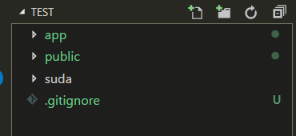
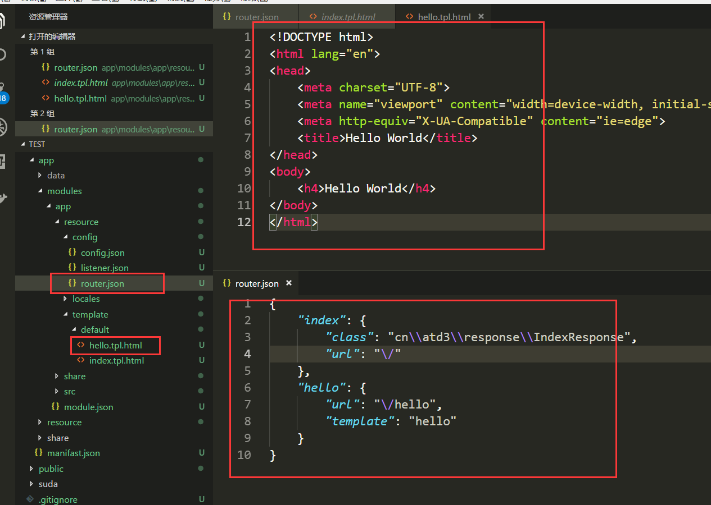

本文将介绍如何使用Suda框架创建一个简单的页面。

<!-- more -->


## 目录文件功能介绍

在创建页面之前，我先介绍一下框架目录下各个文件夹的功能以及作用。 经过上一节内容我们的目录结构应该是如下的结构：



如果不是，或者目录结构是如下样式，则进行一波操作：


### 调整目录结构

1. 在目录下创建一个 `suda` 文件夹，将所有东西拷贝到目录下，现在的目录应该只有一个 `suda` 目录。
2. 打开 suda 目录，找到 `suda->system->resource->project` 目录，将 project 目录下的东西放到当前目录下。

    现在的目录下应该有三个项目
    - suda 文件夹
    - public 文件夹
    - .gitignore 文件
3. 访问网站 host/dev.php ，将会出现上一节的页面。此时目录调整完毕。


### 目录说明

| 文件或者目录 | 说明 |
|-------------|---------|
| suda 目录 | 该目录放置了框架的所有文件 |
| app 目录 | 该目录放置了网站应用程序的所有代码 |
| public 目录 | 该目录放置了一些用户可以访问到的文件以及静态文件 |


### app 目录

在开发的过程中，我们最经常用到的目录就是 `app` 目录，在这个目录下，放置了我们网站程序的所有源码。

| 文件或者目录 | 说明 |
|-------------|---------|
| data 目录 | 该目录放置了网站程序运行时所产生的文件 |
| modules 目录 | 该目录放置了网站应用程序的功能模块，每个模块包含了一个或者多个功能 |
| resource 目录 | 该目录放置了网站程序公用的资源文件 |
| share 目录 | 该目录放置了网站程序公用的代码文件 |
| manifast.json 文件 | 该文件描述了网站应用的一些属性 |

### manifast.json 文件

该文件的默认内容如下，重要属性主要有两个 `modules`, `reachable`

```json
{
    "name": "suda-test-app",
    "namespace": "cn\\atd3",
    "version": "1.0-dev",
    "application": "suda\\core\\Application",
    "modules": ["suda", "app"],
    "reachable": ["app"],
    "language": "zh-CN",
    "url": {
        "mode": 0,
        "beautify": true,
        "rewrite": true
    }
}
```

#### 属性说明 

| 属性 | 说明 |
|-----|------|
| name | 应用的名字 |
| language | 应用的语言 |
| modules | 应用加载的功能模块 |
| reachable | 应用可以使用的模块 |

其中，应用的模块放置在 `app/module` 目录下，现在只有一个模块 `app`，其中 `suda` 模块为内置模块

### 应用配置文件 app/resource/config/config.json

该文件包含了应用的默认配置：

```json
{
    "debug": true,
    "timelimit": 0,
    "timezone": "PRC",
    "markVersion":true,
    "database": {
        "prefix": "dx_", 
        "host": "127.0.0.1", 
        "port": 3306,
        "name": "suda_system", 
        "user": "root",
        "passwd": "root", 
        "charset": "utf8"
    },
    "non-static": "php"
}
```

#### 属性说明 

| 属性 | 说明 |
|-----|------|
| debug | 开启Debug模式，默认开启，会被覆盖 |
| timelimit | PHP允许的最长运行时间，0表示无限 |
| timezone | 设置时区，PRC 中国 |
| markVersion | 显示版本头，在HTTP头部可以看到版本信息 |
| database | 数据库配置信息 |

## 如何创建一个页面

在框架中，所有的页面都依赖于模块而生存，我们来看看 `app/modules/app` 文件夹，也就是app模块，
其中，控制页面URL的文件在模块目录下的 `resource/config/router.json` 文件中。我们看看该文件的内容

```json
{
    "index": {
        "class": "cn\\atd3\\response\\IndexResponse",
        "url": "\/"
    }
}
```

该文件内包含了一个页面的路由，既访问 `/` 时调用 `cn\\atd3\\response\\IndexResponse` 类，本次我们就暂时不讲解调用类，现在就新建一个静态页面即可。

### 步骤1：添加一个页面模板

添加页面模板的位置在模块目录下：`resource/template/模板名/`，其中模板名用default作为默认的模板名，现在往里面加入一个HTML页面,文件名为 `hello.tpl.html`, 注意，扩展名：**tpl.html**

> resource/template/default/hello.tpl.html

```html
<!DOCTYPE html>
<html lang="en">
<head>
    <meta charset="UTF-8">
    <meta name="viewport" content="width=device-width, initial-scale=1.0">
    <meta http-equiv="X-UA-Compatible" content="ie=edge">
    <title>Hello World</title>
</head>
<body>
    <h4>Hello World</h4>
</body>
</html>
```

### 步骤2：添加URL引用

我们创建好页面之后，需要用URL来引用整个页面。在 `resource/config/router.json` 

```json
{
    "index": {
        "class": "cn\\atd3\\response\\IndexResponse",
        "url": "\/"
    },
    "hello": {
        "url": "\/hello",
        "template": "hello"
    }
}
```

`hello` 为URL的名字，`template` 指定的为URL加载的模板，这里省略 `.tpl.html` ，`url`指定了访问时的URL

现在的目录结构如下



此时我们访问页面 ：domain.com/hello 我们会发现是404页面，原因是页面加载了缓存，减低性能消耗


现在我们需要实时访问。则访问：domain.com/dev.php/hello ，其中 dev.php 是开发时入口。会清理缓存并重新写入


由此，一个静态页面就加入成功了。