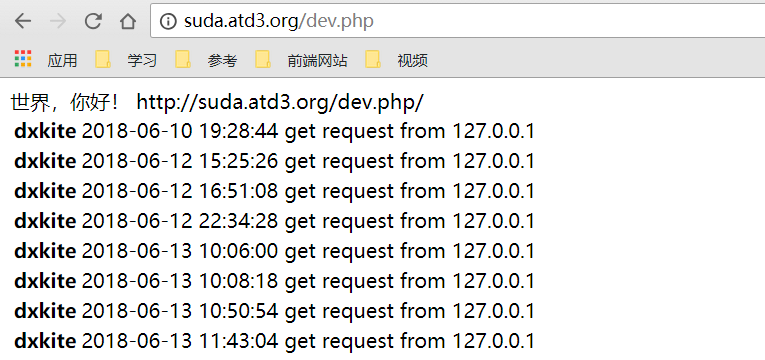
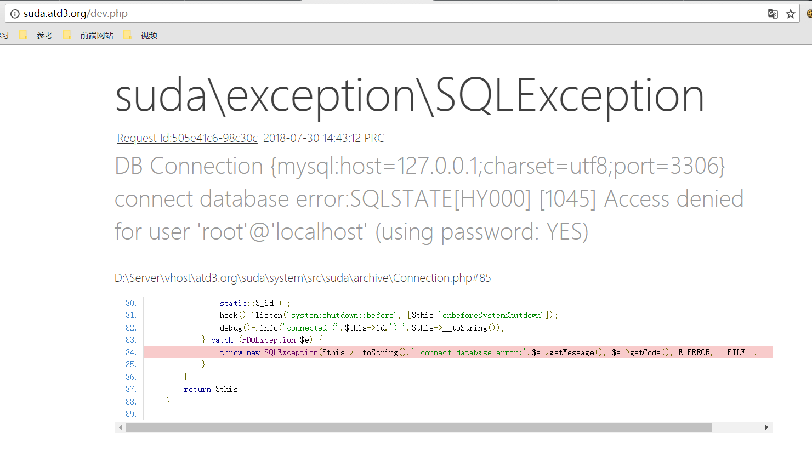
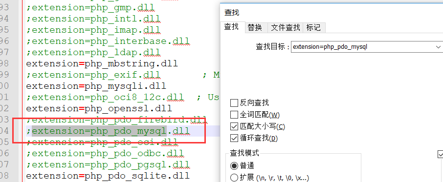

本次基础教程讲解一个我自己开发的Web框架项目的使用，学习前，请保证自己看得懂PHP

<!-- more -->

## 开发环境要求

- 运行环境
    - Windows x86 | Windows x64
    - PHP 7.2.x
    - MySQL | MariaDB 数据库
    - Apache 2.x
- 框架要求
    - 版本 1.2.15 以及以上

**说明**：框架内使用了很多PHP新特性，所以会一直保持PHP的更新迭代，请保证框架使用最新PHP运行，也是提高网站项目运行性能的一个好方法。

## 开发环境安装

- PHP服务器集成环境推荐：
    - PHP Study http://phpstudy.php.cn/phpstudy/PhpStudy20180211.zip

        PHPStudy的可用PHP 7.2版本，内置 yaml 扩展
        - PHP 7.2.1 http://atd-data.cdn.h-k.pw/20180730/4/4_jTvR4r32_php-7.2.1-nts.zip

    - LAMPP/XAMPP 
        - Windows https://www.apachefriends.org/xampp-files/7.2.7/xampp-win32-7.2.7-0-VC15-installer.exe
        - Linux https://www.apachefriends.org/xampp-files/7.2.7/xampp-linux-x64-7.2.7-0-installer.run
- PHP 扩展 
    - php_pdo_mysql（内置）
    - php_yaml （可选 1.2.16支持采用 yaml作为配置文件格式）
- Suda 框架

    直接克隆项目即可：https://github.com/DXkite/suda.git


## 框架配置相关

克隆项目后，将网站根目录调整到 `public` 目录下，访问URL domain.com/dev.php
出现如下界面类似则算框架安装成功：



如果不是这个界面则根据报错修改相关错误

### 错误1：数据库账号密码错误



如果出现上述报错，说明你的MySQL的数据库账号密码错误，解决方案：

* 方案1：修改数据库的账号密码为 root
* 方案2：修改配置文件 `app/resource/config/config.json`

配置文件默认内容：

```json
{
    "debug": true,
    "timelimit": 0,
    "timezone": "PRC",
    "markVersion":true,
    "database": {
        "prefix": "dx_", 
        "host": "127.0.0.1", 
        "port": 3306,
        "name": "suda_system", 
        "user": "root",
        "passwd": "root", 
        "charset": "utf8"
    },
    "non-static": "php"
}
```

其中属性 `database` 为数据库配置


### 错误2：数据库驱动丢失


如果出现上述错误，找到你的PHP的配置文件 `php.ini` 全局搜索 `extension=php_pdo_mysql`



将前面的 `;` 去掉即可


### 错误3：PHP版本错误


如果出现上述错误，在[PHP官网](http://php.net)下载版本为 `PHP7.2`
如下版本为 PHP 7.2.1 ，加入了 yml 配置文件支持。[下载 PHP 7.2.1](http://atd-data.cdn.h-k.pw/20180730/4/4_jTvR4r32_php-7.2.1-nts.zip) 

