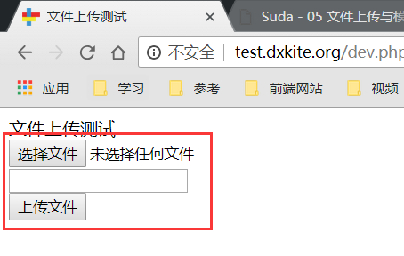
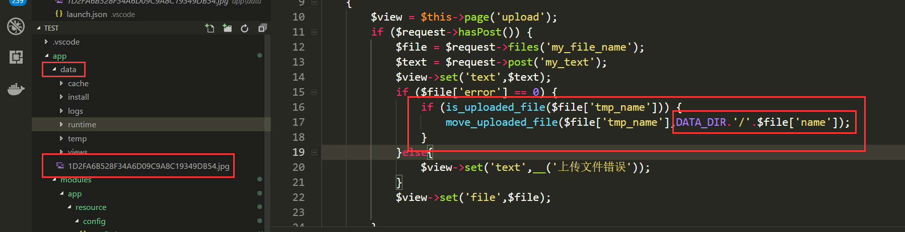

在一个网站中，除了能提交数据以外，还能够上传下载图片，本次讲讲解PHP的文件上传以及处理文件。

<!-- more -->

## 文件上传表单

前一课我们讲了通过GET,POST表单传值，现在我们创建一个文件表单，用来上传文件。

准备工作：
- 创建一个路由 upload_file 匹配地址 /upload-file、 相应类：`cn\atd3\response\UploadResponse`
- 创建一个页面模板  upload , 并使相应类显示这个模板

准备工作完成后，应该能得到这个效果


## 文件上传表单

文件上传的表单和普通的表单不一样，文件上传的表单需要指定内容编码方式（encoding type)  为 `form-data` 
也是就是 `enctype="multipart/form-data"` 如下：

```html
<!-- 必须指定编码方式为 `multipart/form-data` -->
<form action="@u" method="post" enctype="multipart/form-data">
    <div>
        <!-- 指定文件类型 -->
        <input type="file" name="my_file_name">
    </div>
    <div>
        <!-- 上传的同时可以上传数据 -->
        <input type="text" name="my_text">
    </div>
    <div>
        <button type="submit">上传文件</button>
    </div>
</form>
```

在以上代码中，我们指定了一个文件和一个普通字符串作为表单数据。界面现在看起来像是这样：



## 后端处理

按照一般的套路，我们写一个处理代码：

```php
$view = $this->page('upload'); 
if ($request->hasPost()) {
    $file = $request->files('my_file_name');
    $text = $request->post('my_text');
    $view->set('file',$file);
    $view->set('text',$text);
}
$view->render(); 
```

前端HTML代码

```html
<div>文件上传测试</div>
<!-- 必须指定编码方式为 `multipart/form-data` -->
<form action="@u" method="post" enctype="multipart/form-data">
    <div>
        <!-- 指定文件类型 -->
        <input type="file" name="my_file_name">
    </div>
    <div>
        <!-- 上传的同时可以上传数据 -->
        <input type="text" name="my_text">
    </div>
    <div>
        <button type="submit">上传文件</button>
    </div>
</form>

<div>
    <h3>上传的内容</h3>
    <div>{{$:file}}</div>
    <div>{{$:text}}</div>
</div>
```


你会发现出现了报错。报错位置在模板的30行。


报错原因是把数组转换成字符串错误，那么我们在模板中怎么输出数组？


### 输出数组

在模板中，使用 `@foreach` 和 `@endforeacn` 标记来代替PHP中的 `foreach` 和 `endforeach`，语法一致

```html
<h3>上传的内容</h3>
<div>
    <h4>文件内容</h4>
    @foreach ($:file as $key => $value)
    <div>{{ $key}} => {{$value}}</div>
    @endforeach
</div>
<div>{{$:text}}</div>
```

### 字段解释 

在这里输出之后的样式为


其中字段的解释为：

| 字段  | 说明 |
|-------|------|
| name  | 文件名 |
| type | 文件的MIME（Multipurpose Internet Mail Extensions）类型标识符 |
| tmp_name | 文件上传到服务器的临时位置 |
| error | 错误码， 0 表示没有错误，其他错误码 [参考官网](http://www.php.net/manual/zh/features.file-upload.errors.php) |  
| size | 文件大小（字节）|

## 处理上传文件

处理文件我们用到的函数有两个，一个是 `is_uploaded_file` 用来判断是否是上传文件，一个是 `move_uploaded_file` ，用来移动临时文件到指定目录，这里：

```php
if ($file['error'] == 0) {
    // 判断是否为上传文件
    if (is_uploaded_file($file['tmp_name'])) {
        // 从临时文件移动到 DATA_DIR 目录下
        move_uploaded_file($file['tmp_name'],DATA_DIR.'/'.$file['name']);
    }
}else{
    $view->set('text',__('上传文件错误'));
}
```

我指定移动到 `DATA_DIR` 下面，并使用文件原来的名字作为上传后的文件名，可以看到文件的位置在 `app/data` 下面了。



## 作业

自己写好文件上传处理