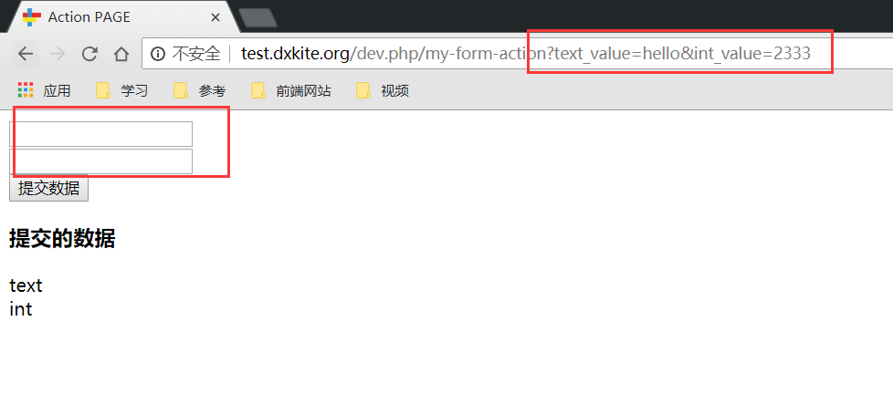
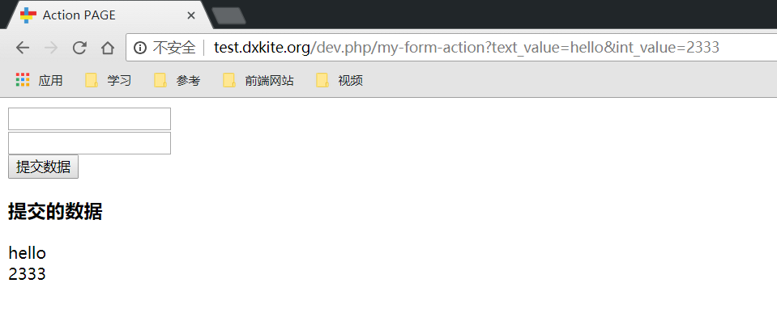

上次课程我们讲了如何使用页面模板，这次课我们讲解一下如何在页面之间传值以及跳转。

<!-- more -->

## 页面的URL

在框架之中，所有的URL都是由 `router.json` 文件来维护生成的，也就是说，所有的URL都是动态的，换而言之，我们不能直接写URL，而是要通过函数来实现生成URL，在PHP代码中，我们通过 `u` 函数来实现获取URL，在页面中，我们通过 `@u` 标记来获取URL，一个URL如何获取？通过他们的唯一名字来获取，函数调用：

```php
$self = u(); // 不加参数表示获取当前的页面URL 
$url = u('hello'); // 获取路由配置中 hello 的URL 
```

当前的页面路由：

```json
{
    "index": {
        "class": "cn\\atd3\\response\\IndexResponse",
        "url": "\/"
    },
    "hello": {
        "url": "\/hello",
        "template": "hello"
    },
    "action_page": {
        "url": "\/action-page",
        "class": "cn\\atd3\\response\\ActionPageResponse"
    }
}
```

测试结果：


我们在模板文件中也可以使用，等价代码：

```html
    <p>@u</p>
    <p>@u('hello')</p>
```

## Form 表单 

创建一个页面，用来显示 form 页面，其中路由名为 `form-action` , URL 为 `/my-form-action` , 调用的类：`cn\atd3\response\FormActionResponse`，使用的模板名称随意，建议 `form-action.tpl.html`

**以上为上节课的练习，不会的多看看上节课**

在模板中添加一个GET表单：


```html
<!DOCTYPE html>
<html lang="en">

<head>
    <meta charset="UTF-8">
    <meta name="viewport" content="width=device-width, initial-scale=1.0">
    <meta http-equiv="X-UA-Compatible" content="ie=edge">
    <title>Action PAGE</title>
</head>

<body>
    <!-- 
    | Form 表单 
    | action 表示提交数据到哪个页面
    | method 表示提交方式（GET，POST 两种） 
    -->
    <form action="@u" method="GET">
        <div>
            <input type="text" name="text_value">
        </div>
        <div>
            <input type="number" name="int_value">
        </div>
        <button>提交数据</button>
    </form>

    <div>
        <h3>提交的数据</h3>
        <div> {{ $:text }} </div>
        <div> {{ $:int }} </div>
    </div>
</body>

</html>
```


如上页面显示后，效果如下：
> **注意：** HTML知识自己要去学

### GET 方法提交数据


随便填写数据，点击提交后的效果如下：



可以看到页面URL上面的值就是我们刚刚提交的数据.那么,如何在PHP中获取到这些数据?我之前提到过我们的 Request 类. 在这个类中,可以获取到GET参数.

```php
<?php
namespace cn\atd3\response;

use suda\core\Request;

class FormActionResponse extends \suda\core\Response
{
    public function onRequest(Request $request)
    {
        $view = $this->page('form-action'); 
        // 如果存在 Get 数据
        if ($request->hasGet()) {
            // 获取 GET 的 text_value 的值并设置到页面的text变量中
            $view->set('text',$request->get('text_value'));
            // 获取 GET 的 int_value 的值并设置到页面的int变量中
            $view->set('int',$request->get('int_value')); 
        }
        $view->render();  // 渲染模板显示出来
    }
}
```

运行结果:



可以看到页面获取到了值并加入进去


### POST 方法提交数据

其实把 method 改成 POST 就可以了, POST与GET的区别大致如下:

1. POST 可以提交的数据比 GET多
2. POST 可以提交文件
3. POST 安全性比GET好一点 数据不是明文传输

POST数据的处理:

```php
<?php
namespace cn\atd3\response;

use suda\core\Request;

class FormActionResponse extends \suda\core\Response
{
    public function onRequest(Request $request)
    {
        $view = $this->page('form-action'); 
        // 如果存在 Get 数据
        if ($request->hasGet()) {
            $view->set('method','GET');
            // 获取 GET 的 text_value 的值并设置到页面的text变量中
            $view->set('text',$request->get('text_value'));
            // 获取 GET 的 int_value 的值并设置到页面的int变量中
            $view->set('int',$request->get('int_value')); 
        }
        else if ($request->hasPost()) {
            $view->set('method','POST');
            // 获取 POST 的 text_value 的值并设置到页面的text变量中
            $view->set('text',$request->post('text_value'));
            // 获取 POST 的 int_value 的值并设置到页面的int变量中
            $view->set('int',$request->post('int_value')); 
        }
        $view->render();  // 渲染模板显示出来
    }
}
```

网页HTML

```html
<!DOCTYPE html>
<html lang="en">

<head>
    <meta charset="UTF-8">
    <meta name="viewport" content="width=device-width, initial-scale=1.0">
    <meta http-equiv="X-UA-Compatible" content="ie=edge">
    <title>Action PAGE</title>
</head>

<body>
    <!-- 
    | Form 表单 
    | action 表示提交数据到哪个页面
    | method 表示提交方式（GET，POST 两种） 
    -->
    <form action="@u" method="GET">
        <div>
            <input type="text" name="text_value">
        </div>
        <div>
            <input type="number" name="int_value">
        </div>
        <button>提交GET数据</button>
    </form>
    <form action="@u" method="POST">
        <div>
            <input type="text" name="text_value">
        </div>
        <div>
            <input type="number" name="int_value">
        </div>
        <button>提交POST数据</button>
    </form>
    <div>
        <h3>提交的数据 {{$:method}} </h3>
        <div> {{ $:text }} </div>
        <div> {{ $:int }} </div>
    </div>
</body>

</html>
```


## 作业

1. 把今天的网页自己写好,我故意没写详细,这样你们多练习下。
2. 写一个超链接，跳到 hello 页面

