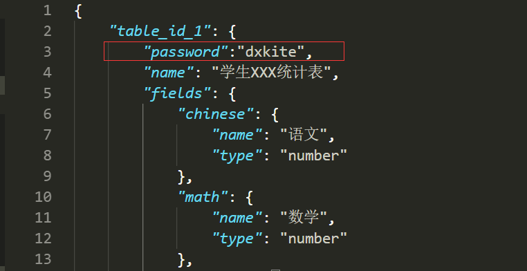

前面我们写了表单填写界面的生成以及表单的创建，今天我们来处理数据的输入和导出

<!-- more -->

## 数据写入

在前面，我们写的 `form` 表单中写入的是 name, number 和一个包含成绩的 data 数组，现在我们来处理它

```php
<?php
namespace dxkite\statistical\response;

use suda\core\Request;

class TableResponse extends \suda\core\Response
{
    public function onRequest(Request $request)
    {
        $tables = app()->getModuleConfig(app()->getFileModule(__FILE__), 'statistic');
        $tableId = $request->get('table_id');
        // 判断是否存在ID
        if (isset($tables[$tableId])) {
            if ($request->hasPost()) {
                // 显示结果页面
                $view = $this->page('state');
                if ($type = $this->insertData($tableId, $request)) {
                    if ($type == 1) {
                        $view->set('message','写入成功');
                    } else {
                        $view->set('message','数据未更新');
                    }
                } else {
                    $view->set('message','写入失败');
                }
                $view->render();
            } else {
                $view = $this->page('table');
                $view->set('fields', $tables[$tableId]['fields']);
                $view->set('name', $tables[$tableId]['name']);
                $view->render();
            }
        } else {
            // 显示404界面
            hook()->exec('system:404');
        }
    }

    public function insertData(string $tableId, Request $request): int
    {
        $table = new \dxkite\statistical\table\StatisticTable;
        if ($request->post('name', null) && $request->post('number', null) && $request->post('data', null)) {
            // 查询条件
            $where = [
                'table_id' => $tableId,
                'student_id' => $request->post('number')
            ];
            // 如果存在学号相同，则更新记录
            // 根据ID更新会更快
            if ($data = $table->select(['id'],$where)->fetch()) {
                if ($table->updateByPrimaryKey($data['id'], [
                    'name' => $request->post('name'),
                    'data' => $request->post('data')
                ])) {
                    // 更新成功
                    return 1;
                } else {
                    // 未跟新
                    return 2;
                }
            } else {
                // 插入新记录
                $id = $table->insert([
                    'table_id' => $tableId,
                    'student_id' => $request->post('number'),
                    'name' => $request->post('name'),
                    'data' => $request->post('data'),
                ]);
                if ($id > 0) {
                    return 1;
                }
            }
        }
        return 0;
    }
}
```

在这里，我们查询 table_id 和 student_id ，是否存在，存在则更新，否则插入。


## 数据下载

我们的数据已经储存在数据库中了，现在我们要它可以导出下载

```php
<?php
namespace dxkite\statistical\response;

use suda\core\Request;

class DownloadResponse extends \suda\core\Response
{
    public function onRequest(Request $request)
    {
        $tables = app()->getModuleConfig(app()->getFileModule(__FILE__), 'statistic');
        $tableId = $request->get('table_id');
        // 判断是否存在ID
        if (isset($tables[$tableId])) {
            $data = $this->exportData($tableId, $tables[$tableId]['fields']);
            // 暂存文件
            $path = RUNTIME_DIR .'/'. $tableId .'.csv';
            storage()->put($path,$data);
            // 生成文件下载
            $this->file($path);
        } else {
            // 显示404界面
            hook()->exec('system:404');
        }
    }

    public function exportData(string $tableId, array $fields): string
    {
        $table = new \dxkite\statistical\table\StatisticTable;
        // 列出同一个表格
        $datas =  $table->listWhere(['table_id' => $tableId]);
        // 生成表头
        $csv = [];
        $csv[0] = [ 0 =>'学号', 1 => '姓名'];
        // 表头ID
        $header = [0,1];
        foreach ($fields as $id  => $value) {
            $csv[0][$id] = $value['name'];
            $header[] = $id;
        }
        // 生成数据
        foreach ($datas as $data) {
            $id = count($csv);
            $csv[$id][0]= $data['student_id'];
            $csv[$id][1]= $data['name'];
            foreach ($data['data'] as $index => $value) {
                $csv[$id][$index]=$value;
            }
        }
        $text = '';
        foreach ($csv as $data) {
            $row = [];
            foreach ($header as $id) {
                $row[] = $data[$id];
            }
            $text .= implode(',', $row) . "\r\n";
        }
        return $text;
    }
}
```

其中  `exportData` 函数是将数据从数据库中取出并生成 `csv` 格式的数据，`file` 函数是将文件生成下载。


## 添加一下密码认证？

```php
<?php
namespace dxkite\statistical\response;

use suda\core\Request;

class DownloadResponse extends \suda\core\Response
{
    public function onRequest(Request $request)
    {
        $tables = app()->getModuleConfig(app()->getFileModule(__FILE__), 'statistic');
        $tableId = $request->get('table_id');
        // 判断是否存在ID
        if (isset($tables[$tableId])) {
            if (isset($tables[$tableId]['password'])) {
                if ($request->get('password') == $tables[$tableId]['password']) {
                    $this->download($tableId, $tables[$tableId]['fields']);
                } else {
                    echo '密码错误';
                }
            } else {
                $this->download($tableId, $tables[$tableId]['fields']);
            }
        } else {
            // 显示404界面
            hook()->exec('system:404');
        }
    }

    public function download(string $tableId, array $fields)
    {
        $data = $this->exportData($tableId, $fields);
        // 暂存文件
        $path = RUNTIME_DIR .'/'. $tableId .'.csv';
        storage()->put($path, $data);
        // 生成文件下载
        $this->file($path);
    }

    public function exportData(string $tableId, array $fields): string
    {
        $table = new \dxkite\statistical\table\StatisticTable;
        // 列出同一个表格
        $datas =  $table->listWhere(['table_id' => $tableId]);
        // 生成表头
        $csv = [];
        $csv[0] = [ 0 =>'学号', 1 => '姓名'];
        // 表头ID
        $header = [0,1];
        foreach ($fields as $id  => $value) {
            $csv[0][$id] = $value['name'];
            $header[] = $id;
        }
        // 生成数据
        foreach ($datas as $data) {
            $id = count($csv);
            $csv[$id][0]= $data['student_id'];
            $csv[$id][1]= $data['name'];
            foreach ($data['data'] as $index => $value) {
                $csv[$id][$index]=$value;
            }
        }
        $text = '';
        foreach ($csv as $data) {
            $row = [];
            foreach ($header as $id) {
                $row[] = $data[$id];
            }
            $text .= implode(',', $row) . "\r\n";
        }
        return $text;
    }
}
```

我把生成下载文件的代码变成了一个函数（因为会写两次），然后验证了一下配置文件是否配置了密码，配置了则要输入密码才可以下载。

配置密码：



下载URL：

`http://score.dxkite.org/dev.php/table_id_1/download?password=密码`

## 作业

- 整合好代码使其能够完整运行起来

----

[完整模块代码下载](suda-results-statistical-data/statistical_18.08.10.mod)