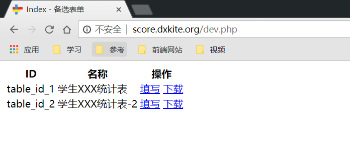
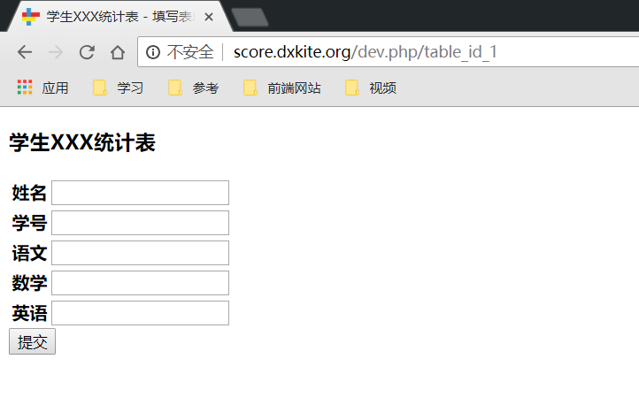

上一篇我们讲了一下数据表，本次将一下部分路由以及处理。

<!-- more -->

## 带参数的路由

上一篇我留了几个路由作业，我挖了个坑

- index 页面，显示可以输入的表格数量，提供一个下载链接
- table 页面，显示输入的表格
- download 页面，提供下载表格的功能

table/result/download 页面最好都要有一个参数，比如 访问的时候 `/table_id/table` 是不是更加给力一些？

在路由中添加参数可以用语法 `{name:type=default}` 来定义参数，支持类型 string,int,url ,说明如下

| 类型 | 说明  |
|------|------|
| string | 一个字符串，匹配除/之外的所有字符 |
| url | 匹配后面的所有参数 |
| int | 匹配数字串 |

### 路由配置

按照如上规则，我们的路由配置如下：

```json
{
    "index": {
        "url": "\/",
        "class": "dxkite\\statistical\\response\\IndexResponse"
    },
    "table": {
        "url": "\/{table_id:string}",
        "class": "dxkite\\statistical\\response\\TableResponse"
    },
    "download": {
        "url": "\/{table_id:string}\/download",
        "class": "dxkite\\statistical\\response\\DownloadResponse"
    }
}
```

可以看到，在 table  和 download 页面中我都插入了参数，这个参数可以通过 get 方式获得。

```php
<?php
namespace dxkite\statistical\response;

use suda\core\Request;

class TableResponse extends \suda\core\Response
{
    public function onRequest(Request $request)
    {
        echo $request->get('table_id');  
    }
}

```


## index 页面

显示当前可以填写的表格，并显示下载链接，目标页面：



**提示** 带有参数的URL生成方式

URL(url_id):`/{table}/xx/`  则 `u('url_id',somevalue)` ，按照顺序填写即可生成URL `/somevalue/xx/`
  
如 table 链接： 

```html
 <a href="@u('table', 表单ID )">填写</a>
```
**HTML界面自己写，模板语法参考：https://github.com/DXkite/suda/blob/master/docs/Template.md**

## index 处理

```php
<?php
namespace dxkite\statistical\response;

use suda\core\Request;

class IndexResponse extends \suda\core\Response
{
    public function onRequest(Request $request)
    {
        $view = $this->page('index');
        // 加载 resource/config/statistic.json 文件

        $tables = app()->getModuleConfig(app()->getFileModule(__FILE__),'statistic');
        $list = [];
        // 解析拼凑成可以显示的结构
        foreach ($tables as $id => $attr) {
            $list[$id]['id'] = $id;
            $list[$id]['name']= $attr['name'];
        }
        // 压入到HTML view中显示
        $view->set('list',$list);
        $view->render();
    }
}
```

## 填写表格显示

目标页面，能够根据配置文件生成相应的页面：



### 模板文件

```html
<!DOCTYPE html>
<html lang="en">

<head>
    <meta charset="UTF-8">
    <meta name="viewport" content="width=device-width, initial-scale=1.0">
    <meta http-equiv="X-UA-Compatible" content="ie=edge">
    <title>{{$:name}} - 填写表单</title>
</head>

<body>
    <h3>{{$:name}}</h3>
    <form action="@u" method="post">
    <table>
        <tr>
            <th>姓名</th>
            <td>
                <input type="text" name="name" />
            </td>
        </tr>
        <tr>
            <th>学号</th>
            <td>
                <input type="text" name="number" />
            </td>
        </tr>
        @foreach ($:fields as $id => $field) 
        <tr>
            <th>{{$field['name']}}</th>
            <td>
                @if ($field['type'] == 'text')
                    <textarea name="data[{{$id}}]" cols="30" rows="10" required></textarea>
                @elseif ($field['type'] == 'number')
                    <input type="number" name="data[{{$id}}]" required> 
                @else
                    <input type="text" name="data[{{$id}}]" required> 
                @endif
            </td>
         @endforeach
        </tr>
        
    </table>
    <button>提交</button>
</form>
</body>

</html>
```

### PHP文件


```php
<?php
namespace dxkite\statistical\response;

use suda\core\Request;

class TableResponse extends \suda\core\Response
{
    public function onRequest(Request $request)
    {
        
        $tables = app()->getModuleConfig(app()->getFileModule(__FILE__), 'statistic');
        $tableId = $request->get('table_id');
        // 判断是否存在ID
        if (isset($tables[$tableId])) {
            $view = $this->page('table');
            $view->set('fields',$tables[$tableId]['fields']);
            $view->set('name',$tables[$tableId]['name']);
            $view->render();
        } else {
            // 显示404界面
            hook()->exec('system:404');
        }
    }
}
```

## 作业

- 创建好相关路由页面
