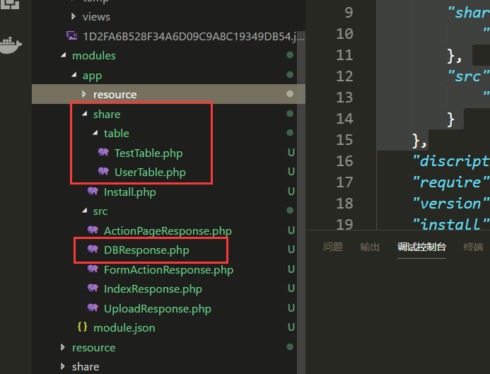
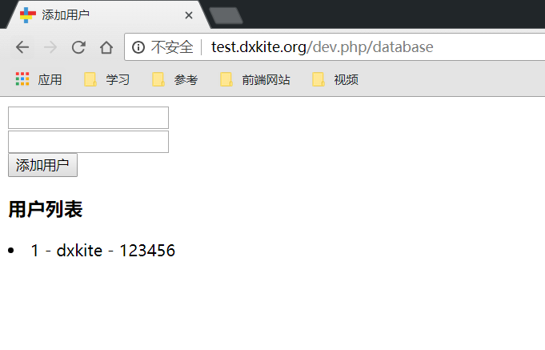

一个网站，没有数据库和有数据库是两样，今天我们来学习把数据持久化到数据库中。
准备工作：
- 创建一个路由 database 匹配地址 /database、 相应类：`cn\atd3\response\DBResponse`
- 创建一个页面模板  database , 并使相应类显示这个模板
<!-- more -->

## 添加数据表

在 Suda 框架中，数据表不需要手动创建，我们在使用的时候继承 `suda\archive\Table` 类即可。
这里我们创建一个数据表：

```php
<?php
namespace cn\atd3\table;
class UserTable extends \suda\archive\Table {
    public function  __construct(){
        // 数据表名
        parent::__construct('user');
    }
    protected function onBuildCreator($table){
        $table->fields(
            // 键名id，类型，长度省略 添加主键(primary)，自动增长(auto) 
            $table->field('id','bigint')->primary()->auto(),
            $table->field('name','varchar',30),
            $table->field('password','varchar', 255)
        );
        return $table;
    }
}
```
一般来说，创建一个数据表就是以上代码即可，其中，`onBuildCreator` 放置数据表构建描述代码。
在 `__construct` 中调用父类的构造函数指定创建的数据表名。具体的函数参考可以找到Suda文件夹下的：  `docs/classes/suda/archive/Table.md` 文件查看文档 

## 创建数据处理类

```php
<?php
namespace cn\atd3\response;

// 引用 UserTable 
use cn\atd3\table\UserTable;
use suda\core\Request;

class DBResponse extends \suda\core\Response
{
    public function onRequest(Request $request)
    {
        $view = $this->page('database'); 
        // 新建数据表对象
        $table = new UserTable;
        if ($request->hasPost()) {
            // 插入一条数据
            $table->insert([
                'name' => $request->post('name'),
                'password' => $request->post('password'),
            ]);
        }
        // 获取数据（ list 方法 可以获取全部数据）
        $view->set('user',$table->list());
        $view->render();  
    }
}
```

细心的同学可能发现了，在代码里我好像都没有使用 `require`，`include` 啥的，这是框架帮我们自动加载了，
比如这个 `cn\atd3\table\UserTable` 数据表类，框架会自动搜索模板目录，查看模板配置：

```json
"import": {
    "share": {
        "cn\\atd3": "share"
    },
    "src": {
        "cn\\atd3\\response": "src"
    }
},
```
在我们模块里面有这样一串代码，这里指定了 `cn\atd3` 命名空间找文件的路径是模块下的 `share` 路径，`cn\atd3\response` 要去 `src` 路径找。
所以，我们 `DBResponse.php` 文件应该放在 `src/DBResponse.php`，`UserTable.php` 应该放在 `share/table/UserTable.php` 文件下面：



在这个处理类中，表我们使用了两个方法：

`insert` 方法和 `list` 方法 ,对应的参考文件  `docs/classes/suda/archive/Table/insert.md`、`docs/classes/suda/archive/Table/list.md`

一个是插入数据，一个是列出数据，具体都可以看参考文件

## 构建界面

界面我们现在需要有两个功能，才能配上处理文件：

1. 能够提交POST表单，数据为 `name` 和 `password`
2. 能够显示数组列表

现在的HTML界面如下

```html
<!DOCTYPE html>
<html lang="en">
<head>
    <meta charset="UTF-8">
    <meta name="viewport" content="width=device-width, initial-scale=1.0">
    <meta http-equiv="X-UA-Compatible" content="ie=edge">
    <title>添加用户</title>
</head>
<body>
    <div>
        <form action="@u" method="POST">
            <div>
                <input type="text" name="name">
            </div>
            <div>
                <input type="text" name="password">
            </div>
            <button>添加用户</button>
        </form>
    </div>
    <div>
        <h3>用户列表</h3>
        <!-- 与PHP If 一致 -->
        @if (is_array($:user))
            @foreach ( $:user as $user)
            <li>{{ $user['id'] }} - {{$user['name']}} - {{$user['password']}} </li>
            @endforeach
        @else
            <div>空用户</div>
        @endif
    </div>
</body>
</html>
```

运行界面：


我们测试插入一条数据



可以看到数据插入成功了

## 作业

- 实现以上的功能
- 尝试 update 方法和 delete 方法


## 参考链接

- 数据表：https://github.com/DXkite/suda/blob/master/docs/classes/suda/archive/Table.md
