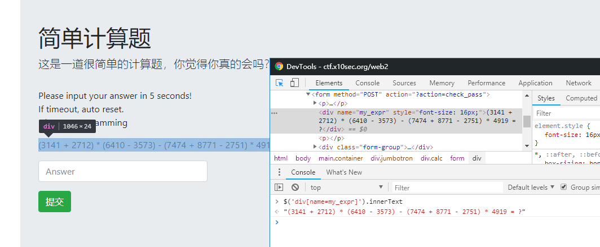

- 题目地址：https://ctf.x10sec.org/web2
- 题目级别：入门级
- 题目考察：
    - 基本编程技能
    - 网页处理

<!-- more -->

## 步骤1：观察页面结构，获取题目页面

通过浏览器开发工具查看页面结构，定位到页面表达式节点元素，从下图可以看到，页面表达式元素的位置为 `div[name=my_expr]` 节点的内容。



在这里，我们使用 `Python` 的 `requests` 库来请求页面。

```python
import requests
# 创建一个回话，保证Cookie的一致性
user = requests.session()
# GET 页面
res = user.get('https://ctf.x10sec.org/web2/')
print(res.text)
```

运行以上脚本后，我们获取了页面的HTML。

## 步骤2：使用Python提取表达式

提取页面表达式我们一般用正则来提取，从HTML中提取节点一般用 `PyQuery` 来提取，使用方式和 `JQuery` 类似

```python
import requests
from pyquery import PyQuery as PQ
user = requests.session()
res = user.get('https://ctf.x10sec.org/web2/')
# 创建 DOM 树
dom=PQ(res.text)
# 查询节点
print(dom('div[name=my_expr]').text().strip())
```

运行上述代码后，我们的表达式都是正规的英文字符，所以我们使用 `Python` 来直接计算，去掉等号，计算

```python
import requests
import re
from pyquery import PyQuery as PQ
user = requests.session()
res = user.get('https://ctf.x10sec.org/web2/')
dom=PQ(res.text)
get = dom('div[name=my_expr]').text().strip()
# 正则提取表达式 去除括号
exp=re.search('^(.+)=.+$', get).group(1)
ans = eval(exp)
print(ans)
```

## 步骤3：提交答案

从提取的页面可以看到，答案提交的地址是 `https://ctf.x10sec.org/web2?action=check_pass` 提交的字段也不多，就一条 `pass_key`
提交答案后，如果提交失败会提示 `Wrong Answer` ，提交正确的时候原表达式的位置会是flag，因此，有如下脚本

```python
# encoding = utf-8

from pyquery import PyQuery as PQ
import re
import requests


user = requests.session();
res = user.get('https://ctf.x10sec.org/web2/')
dom = PQ(res.text)
get = dom('div[name=my_expr]').text().strip()
exp=re.search('^(.+)=.+$', get).group(1)
ans = eval(exp)
# POST 提交答案
res = user.post('https://ctf.x10sec.org/web2?action=check_pass',{
    'pass_key' : ans,
});
# 判断返回页面
if re.search('Wrong Answer',res.text):
    print ("Wrong Answer")
else:
    print ("I Get Flag: %s" % PQ(res.text)('div[name=my_expr]').text().strip())

```

入门级难度，代码讲的比较详细，具体用法自己去摸索下，Python最好多用用
