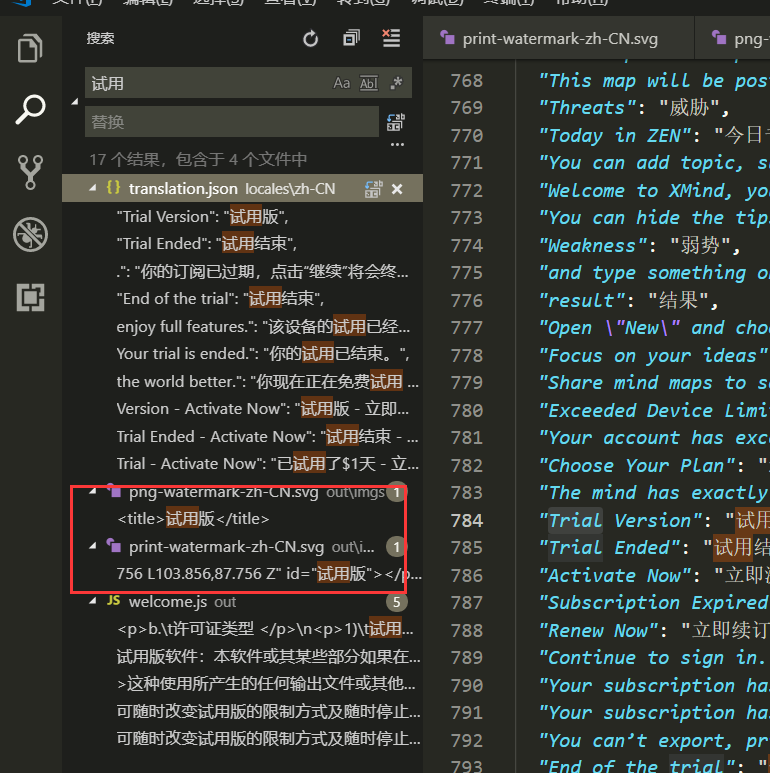

本文介绍如何将 `XMind ZEN` 的水印去除，  `XMind ZEN`  是一款免费的软件，采用 `Electron` 开发，有兴趣的可以了解下，由于是免费的，破解版和非破版没啥区别，除了导出图片的时候有个水印还有保存的时候订阅弹窗啥的，作为程序员的我很理解这种行为，毕竟自己的软件被大众使用还是可以的。本文简单讲解以下去水印。

**去水印本文用的是最简单的方式，而不是破解！不是破解**，请有能力的时候支持正版。

<!-- more -->

## 解题思路

`Eletron` 应用有个很明显的特征，不管你程序多大，，嗯，都自带了内置浏览器，毕竟跨平台嘛，资源什么的，对于 `Electron` 来说，可以压缩成 `app.asar` 也可以直接就是个资源包，打开 `XMind ZEN` 的安装目录，可以看到如下结构：

从这个结构来看，应该是没打包的，打包了的话，可以参考我以前写的 `StarUML` 系列破解方式解包了再打包。从水印的情况上看，应该是使用图片或者代码生成的，全局搜索文字：`试用` 或者 `Trial` 可以看到：

有几个 `svg` , 那么这个应该就是水印的图片了，还以为是用代码生成的，打开看看：

可以看到，确实是水印图片，怎么处理？

- A. 删除
- B. 替换

我们这里用修改，或者说替换，矢量图片都可以直接编辑：

将不透明度设置为0，即全透明，不影响导出就行了。

矢量图文件位置：`resources\out\imgs\[类型]-watermark-[语言].svg`
如：中文的PNG导出的水印：矢量图文件位置：`resources\out\imgs\png-watermark-zh-CN.svg`