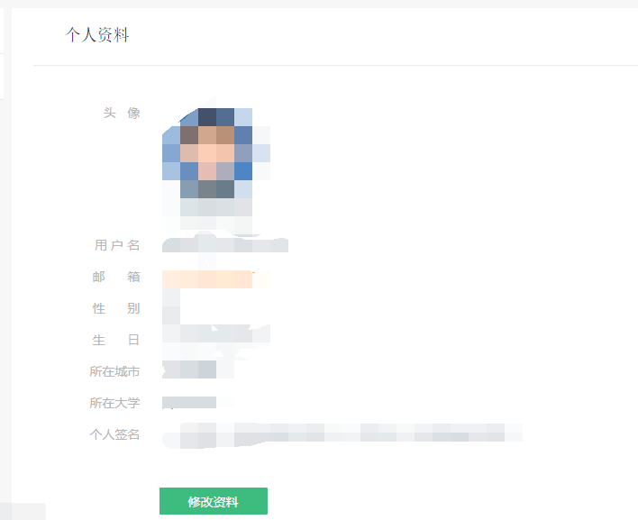
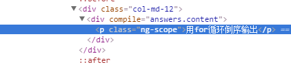
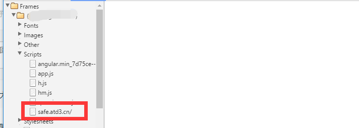
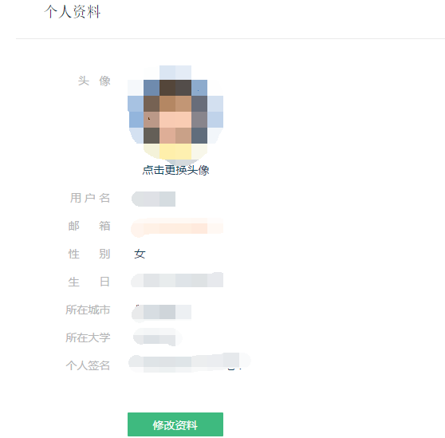
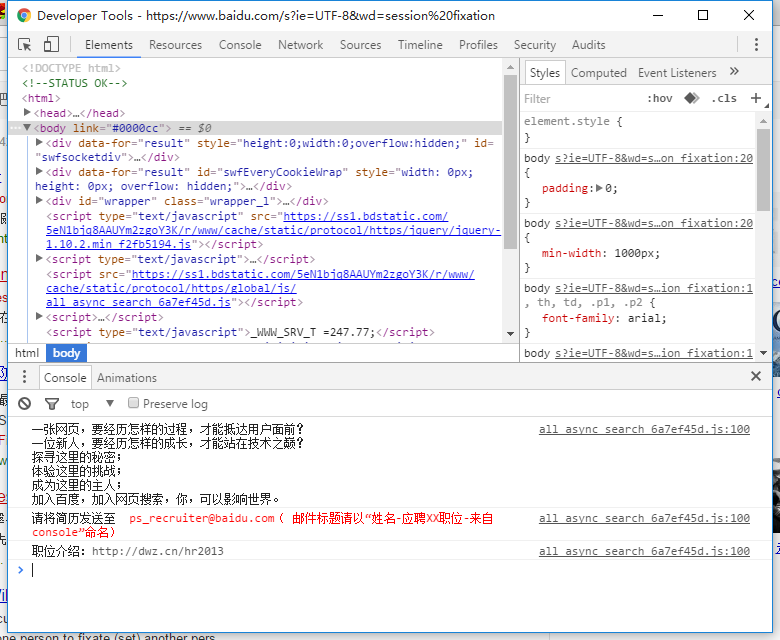
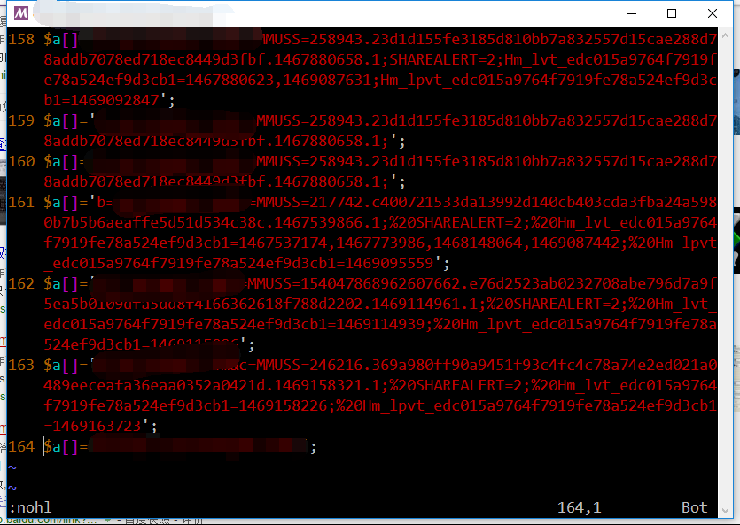
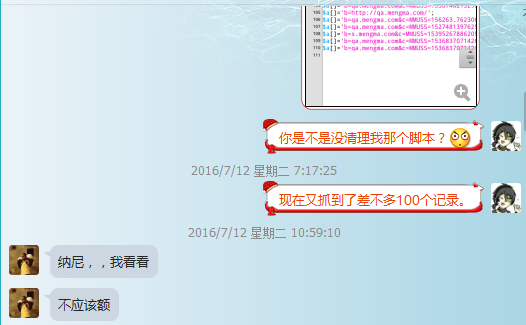

第一次实地操作web渗透？

<!-- more -->

啊哈哈，结果还是喜人的，附上Cookie登陆后的图：



常规信息已经打码，本次web渗透的成功原因有两个
## 1. XSS注入漏洞若干  
为啥这么说勒？若干？反正不是第一次在这个网站上发现XSS漏洞了，想我当初把XSS当作一个玩具，咳咳，，注入CSS样式表，发奇怪的帖子，就是自定义样式的帖子，嗯，后续和网站的客服妹子联系后修补了。看了《XSS跨站脚本攻击剖析与防御》后，才知道这个漏洞叫XSS注入漏洞，手痒痒，就再次对这个网站进行了测试，不测试不知道,已测试，我尼玛，，先贴测试脚本

```html

```

这是一个中规中矩的测试脚本，在网页中插入图片，由于图片没有指定的url
然后会调用`onerror`事件，在`onerror`事件中会创建一个脚本链接，发出跨站请求，请求的查询字符为网页的`cookie`和域名
反正这是我的一个简易后台代码,PHP做服务器端的

```php
<?php
$file_name='cookie.php';
if (!file_exists($file_name))
	file_put_contents($file_name,"<?php \$a=[];\n");
if (isset($_SERVER['QUERY_STRING']))
{
	file_put_contents($file_name,'$a[]=\''.$_SERVER['QUERY_STRING']."';\n",FILE_APPEND);
}
```

好了，前期准备做好了，接下来开始注入测试，，，进入网站，，
直接插入一个简单的代码

```html

```

这个是用来测试XSS漏洞的，，由于篇幅原因，我直接拿最致命的XSS注入载体---markdown编辑器来做示范吧,如图


咳咳，，嗯，我顺带回答了问题，看看注入后的效果



啥都木有，是不是插入失败了？不。脚本自我删除了，唯一的痕迹就在这里



然后，，我们去服务器看看，，由于时原因，我就没等这个小伙子再次访问这个页面了，拿个其他小伙子的截图凑合一下，，额，四次捕获同一个小伙子


侬，这是XSS注入的后果，成功拿到了cookie，可是高兴的太早了，，如果这样就可以过了，那标题就不是混合了，，，
接下来是第二个成功原因`session fixation`漏洞

## 2. session fixation 攻击

第一次XSS攻击成功获取到了cookie，，哎，还是说说这个玩意吧，，
毕竟网站的开发者考虑到了XSS注入，却没关注到这点，开发者做过XSS防范，如图


看图`HTTP`的红色标记，，这个是标记了`HttpOnly`的cookie，通过这个，我们用脚本
`document.cookie`获取的cookie就不完整了，，，如图，，


可怕。我一直在想怎么绕过这个，，可惜哦。不可以。。
还有要吐槽的是那个箭头标注的cookie名，反正我盗取的cookie都一个样，，亏我还以为他是随机生成的，哎
cookie不完整，，经过测试，，我发现特么只需要一个cookie就好了，，


通过抓包软件，抓到的数据包可以证明：


然后还有更无语的,那个我特么则怎么都获取不到的`HttpOnly`的cookie直接出现在了返回的包里，也是没得讲了


就问傻不傻~！session fixation攻击，，？应该就是叫这个来着
咳咳咳。。。嗯，获取到的返回页面，再截图一个，，，



哎呀呀，居然是个妹子，，咳咳，单身30年，见谅（年18.。。。。。
这次漏洞危险性已经可以得到证明了，说大不大，说小不小。嗯，，，
已经和客服联系了，毕竟是朋友（关键是妹子:P），后续的自我复制就算了了。没必要搞得整个网站都挂上我的XSS不是么。。
啊哈哈，好了，总结，，

## 3. 总结
在此次渗透过程中我使用了三种方式

1. XSS 注入
2. session fixation 探测
3. iframe 劫持  
	这个东西麽。网站对其有防范。。。就不截图了

在自己设置网站的过程中，应该注意的就是一些细节问题。咳，脑残的对百度进行了session fixation试探，删除一个cookie
直接变成了未登陆状态，咳，还意外发现了这个：



所以说，机会只留给那些有啥啥啥的人。别再感叹无法求职，或许你按一个`F12`键，求职单就来了

>本文章写作的目的不是教你如何去进行恶意的破坏活动，而是为了教你如何抵御这些攻击行为


---

刚刚又去看了下盗取的后台，尽管和网站负责人交流过过后，还是有部分脚本没删除干净，不过，怪我咯~



